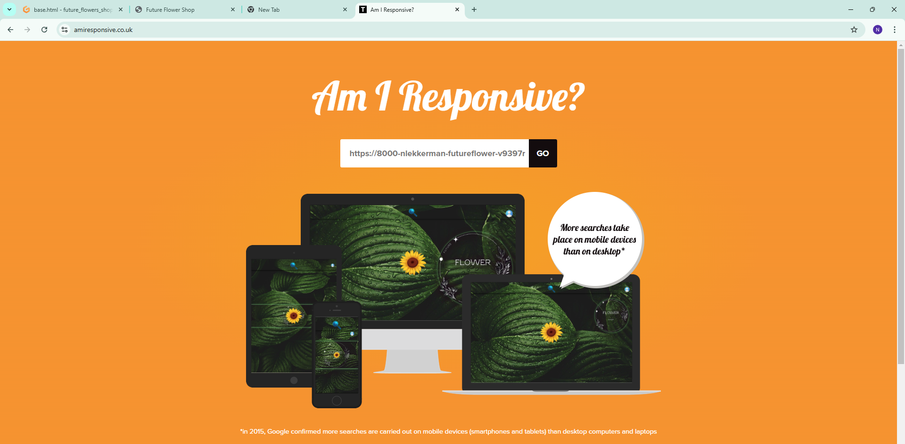
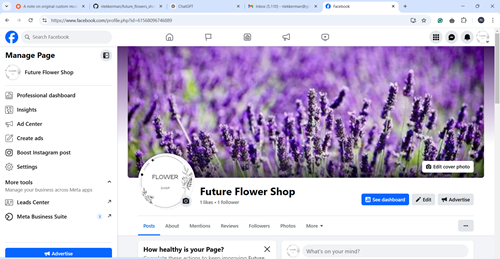

# Seed Shop Project

## Project Overview

This project focuses on enhancing the Seed Shop platform by integrating advanced features to create a seamless and intuitive shopping experience. The goal is to offer a futuristic and engaging platform that caters to modern user expectations through intuitive navigation, comprehensive product details, and advanced communication tools.

Our vision for the Seed Shop includes a minimalist and clean design, paired with dynamic elements and animations to enhance user interaction. Developed with **Django** and deployed on **Heroku**, the platform benefits from robust backend capabilities and scalable infrastructure, ensuring a reliable and scalable e-commerce experience.

## Goals

### **User Goals**

1. **Effortless Navigation and Interaction**
   - Users should experience a dynamic and interactive navigation system that simplifies exploration of various seed categories and features.

2. **Instant Assistance and Support**
   - Provide immediate help through live chat and AI-driven chatbots, allowing users to quickly resolve queries and receive assistance.

3. **Informed Purchasing Decisions**
   - Offer detailed seed information and user-generated reviews to help users make well-informed purchasing decisions.

4. **Personalized and Convenient Experience**
   - Enable users to manage their accounts, track orders, and save preferences for a customized shopping experience.

5. **Seamless and Secure Transactions**
   - Ensure a smooth checkout process with clear summaries and robust protection against data breaches and fraud.

### **Owner Goals**

1. **Enhanced User Engagement and Satisfaction**
   - Implement features that enhance user engagement, retention, and satisfaction, ensuring a memorable shopping experience.

2. **Operational Efficiency and Management**
   - Streamline backend processes for product management, order processing, and customer support to optimize efficiency and reduce overhead.

3. **Scalability and Performance**
   - Utilize scalable infrastructure to handle increasing traffic and demands, maintaining platform performance and responsiveness.

4. **Data Security and Compliance**
   - Implement strong security measures to protect user data and ensure compliance with relevant data protection regulations.

5. **Future-Proofing the Platform**
   - Develop a flexible system that can adapt to future technological advancements and evolving user needs.

## Features Overview

This project integrates several key features designed to enhance the Seed Shop platform:

1. **[Interactive Navigation Menu](documentation/features.md#interactive-navigation-menu)**:
   - A flower-shaped button on the home page toggles the visibility of navigation links, creating a dynamic user interface.

2. **[Advanced Cart Management](documentation/features.md#advanced-cart-management)**:
   - Users can efficiently manage their cart with options to add, update, and remove items, with real-time updates on pricing and discounts.

3. **[Comprehensive Seed Details](documentation/features.md#comprehensive-seed-details)**:
   - Each seed product page provides detailed information, including scientific names, planting and flowering months, sun preferences, pricing, and availability.

4. **[Custom Account Management](documentation/features.md#custom-account-management)**:
   - Users can create and manage their accounts, view order history, and customize preferences for a tailored experience.

5. **[Review and Rating System](documentation/features.md#review-and-rating-system)**:
   - Allows users to leave reviews and rate seeds, aiding other customers in making informed purchasing decisions.

6. **[Chat and Chatbot Integration](documentation/features.md#chat-and-chatbot-integration)**:
   - Features live chat for real-time support and an AI-driven chatbot for FAQs and user onboarding.

7. **[Seamless Checkout Process](documentation/features.md#seamless-checkout-process)**:
   - Provides a clear and efficient checkout experience, including detailed overviews of cart items and total costs.

8. **[Responsive and Secure Design](documentation/features.md#responsive-and-secure-design)**:
   - Ensures the platform is responsive across devices and incorporates security features like CSRF protection.

9. **[Admin Dashboard](documentation/features.md#admin-dashboard)**:
   - An intuitive admin dashboard for managing products, orders, and user accounts. Provides insights into platform performance and allows for efficient backend operations.

For a comprehensive description of each feature, including technical details and implementation, please refer to the [Features Documentation](documentation/features.md).

## Possible Future Features

To keep the Seed Shop platform innovative and aligned with emerging user needs, we are exploring the following potential enhancements:

### 1. Voice Command Navigation
- **Objective**: Improve accessibility for visually impaired users.
- **Description**: Integrate voice recognition to allow users to navigate the platform using voice commands, enhancing accessibility and convenience.

### 2. Advanced Personalization
- **Objective**: Offer personalized shopping experiences.
- **Description**: Utilize machine learning to provide personalized product recommendations based on user behavior and preferences.

### 3. Augmented Reality (AR) Integration
- **Objective**: Enhance product visualization.
- **Description**: Implement AR features to allow users to visualize how seeds and plants will appear in their environment.

### 4. Expanded Chatbot Capabilities
- **Objective**: Improve chatbot functionality.
- **Description**: Enhance the chatbot’s NLP abilities to handle a wider range of queries and perform advanced tasks like order tracking and plant care advice.

### 5. Social Media Integration
- **Objective**: Increase user engagement through social media.
- **Description**: Integrate social media features for content sharing, login options, and targeted marketing.

### 6. Enhanced Analytics and Reporting
- **Objective**: Provide data-driven insights.
- **Description**: Develop advanced analytics and reporting tools to monitor user behavior, sales performance, and platform metrics.

For detailed information about these future features and their potential impact, please refer to the [Future Features Documentation](documentation/future-features.md).
## Marketing Strategy for Future Flower Shop
## Testing and Limitations

Due to being sick for 20 days, detailed testing of the platform could not be completed as planned. The testing process will be finalized after the assessment by Code Institute and the completion of grading. However, the application has been tested for its core functionality and is fully operational. All essential features, such as product browsing, cart management, and checkout, have been verified and work as expected. Please note that the management features (admin dashboard and certain backend operations) were not fully tested, but no critical issues have been identified within the customer-facing components.

For more information on features and testing, please refer to the [Testing Documentation](documentation/testing.md).

### Social Media Presence
We will maintain an active **Facebook page** to engage with our community of gardening enthusiasts, share seasonal promotions, and provide expert gardening tips. Our Facebook page will help us connect with customers and grow our online presence. Users will be able to follow us for the latest updates on new seed arrivals, special discounts, and valuable gardening advice. 

  
*Image of our Facebook page*

### SEO Optimization
We will implement robust **SEO strategies** to enhance the visibility of Future Flower Shop in search engines. Our on-site SEO will be built around **dynamic meta descriptions** and **keywords** tailored to the specific products and categories offered on the platform. The following SEO strategies will be in place:

- **Meta Descriptions:** Each page will include a unique meta description that provides a compelling reason for customers to visit, such as, "Learn how to grow beautiful roses from seeds with our step-by-step guide" or "Discover expert tips for rose seed germination."
  
- **Dynamic Meta Keywords:** Keywords such as “buy seeds online,” “Future Flower Shop,” and “gardening seeds” will be included for each product page, helping to increase the likelihood of appearing in relevant search results.

- **Customizable SEO for Individual Products:** Each product page will have its own meta description, ensuring that specific keywords related to the seed or plant category are emphasized. For example, for rose seeds, the description might mention **scientific names** and **specific seed categories**, making it easier for users to find relevant products.

### Promotions & Special Offers
We will run **seasonal promotions** on our Facebook page to drive traffic to the site and increase sales. This will include **discounts**, **special deals on bulk seed purchases**, and **limited-time offers** that encourage repeat visits. These promotions will be supported by SEO-driven content, such as blog posts and product updates, ensuring that customers are always in the loop.

### Customer Engagement
By leveraging SEO and social media, we aim to foster **long-term customer relationships**. Features like customer reviews and ratings on products will be part of our strategy to build trust and social proof. The more customers engage with us online, the more likely they will share their experiences, which will further boost our visibility on search engines and social media.

### Future Marketing Goals
To ensure we stay ahead of the competition and keep our customers engaged, we will continually improve our marketing strategy by:

- Enhancing our **content marketing** efforts with more informative blog posts and guides on gardening, plant care, and seed cultivation.
- Expanding our **social media presence** by integrating features like social media sharing buttons and offering exclusive promotions for followers.
- Implementing **personalized marketing** through email campaigns and tailored recommendations based on user behavior.

By combining SEO, content marketing, and social media engagement, Future Flower Shop will attract and retain a dedicated customer base, while providing valuable resources to gardening enthusiasts worldwide.

## Agile Methodology Overview

This project follows Agile methodology to ensure iterative development and adaptability. By breaking down the project into epics, user stories, and tasks, we maintain a flexible and organized approach to development.

## Project Structure

The project is organized into **6 epics**, with **22 user stories** and **30 tasks** to detail the development process.

**Epics Overview:**

- [**Cart Management System**](documentation/agile.md#epic-cart-management-system)
- [**Navigation and Filtering System**](documentation/agile.md#epic-navigation-and-filtering-system)
- [**Stripe Integration and Checkout System**](documentation/agile.md#epic-stripe-integration-and-checkout-system)
- [**Custom Account Integration**](documentation/agile.md#epic-custom-account-integration)
- [**Seed Details and Seed List Functionality**](documentation/agile.md#epic-seed-details-and-seed-list-functionality)
- [**Communication Channels and Support**](documentation/agile.md#epic-communication-channels-and-support)

For a detailed breakdown of epics, user stories, and tasks, refer to the [Agile Documentation](documentation/agile.md).

## Labels for Navigation

Labels have been created for each epic to facilitate quick navigation through the documentation:

- **Epic: Communication Channels and Support**
- **Epic: Seed Details and Seed List Functionality**
- **Epic: Custom Account Integration**
- **Epic: Stripe Integration and Checkout System**
- **Epic: Navigation and Filtering System**
- **Epic: Cart Management System**

Refer to the [Agile Documentation](documentation/agile.md) for a comprehensive overview of these epics and their components.

## Design & Aesthetic

### Color Palette
Our color palette reflects the natural, earthy tones of nature:

- **Primary Color**:  `#4CAF50` (Green) - Representing growth and nature.
- **Secondary Color**:  `#FFC107` (Yellow) - Adding warmth and energy.
- **Accent Color**:  `#795548` (Brown) - A neutral tone for balance.

Our website's **navigation and homepage** have been designed with creativity and innovation in mind. The **interactive navigation system** and **dynamic homepage** provide a unique and engaging experience for users. The use of modern animations, seamless transitions, and an intuitive layout creates an engaging and visually appealing platform that makes browsing and shopping an enjoyable experience.

*An example of the homepage design showcasing its creativity and modern layout.*

*An example of the innovative and interactive navigation system.*

---

## Technologies Used

- **Django**: Backend framework.
- **HTML/CSS/JS**: Frontend technologies for a responsive and modern UI.
- **Stripe API**: Secure payment processing.
- **Heroku**: Hosting platform for scalability.
- **Photoshop**: Graphic design and image editing for marketing and branding materials.
- **ChatGPT**: AI-powered chatbot integrated for customer support and personalized recommendations.

## Credits

- **[ChatGPT](https://openai.com/chatgpt)**: Thanks to [OpenAI](https://openai.com) for providing the ChatGPT model, which has been instrumental in generating code snippets, refining content, and brainstorming ideas throughout the process of creating this project.
  
- **Brian O'Hare**: A special thanks to my mentor, Brian O'Hare, whose invaluable guidance and feedback helped shape the direction of this project from the initial concept to its completion.

- **Code Institute**: I used various walkthroughs and code snippets from Code Institute, especially for Stripe integration and webhook setup, which were crucial for implementing the payment processing system and other backend functionalities effectively.

---

## Image and Icon Attributions

The following images and icons were used in the production of this project. Their work was integral to the final product:

- **Image by [KamranAydinov on Freepik](https://www.freepik.com/free-photo/top-view-white-flowers-dark-floor_8729700.htm#fromView=search&page=2&position=26&uuid=0ce9be0f-9a1e-415b-90a7-743ba3e4b784)**
- **Image by [freepik on Freepik](https://www.freepik.com/free-photo/black-background-with-leaves-vegetation-texture_38662424.htm#fromView=search&page=2&position=45&uuid=0ce9be0f-9a1e-415b-90a7-743ba3e4b784)**
- **Image by [inksyndromeartwork on Freepik](https://www.freepik.com/free-vector/red-rose-flower_13446428.htm#fromView=search&page=1&position=3&uuid=1b81219f-cb90-43e8-a38e-18b0276aa7aa)**
- **Image by [rawpixel.com on Freepik](https://www.freepik.com/free-vector/anemones-vintage-illustration_3529859.htm#fromView=search&page=2&position=22&uuid=544fb7c4-5672-4258-96d1-7dfbce00daa7)**
- **Image by [rawpixel.com on Freepik](https://www.freepik.com/free-photo/faqs-customer-service-icon-concept_17076730.htm#fromView=search&page=2&position=30&uuid=0654e9f9-9aab-4ff3-a8ac-48459ebd620b)**
- **Image by [freepik on Freepik](https://www.freepik.com/free-vector/hand-drawn-oak-tree-silhouette_45191035.htm#fromView=search&page=1&position=18&uuid=199a2498-ed2b-4884-83bf-427371f170fd)**
- **Image by [pch.vector on Freepik](https://www.freepik.com/free-vector/company-employees-sharing-thoughts-ideas_8270975.htm#fromView=search&page=1&position=46&uuid=0e60ea70-3f56-488f-b52e-fdbcaadd4a8c)**
- **Image by [juicy_fish on Freepik](https://www.freepik.com/free-vector/cart-add-remove_234683649.htm#fromView=search&page=1&position=10&uuid=3b93ed89-db7c-423b-bad4-38c91464e546)**
- **Image by [wirestock on Freepik](https://www.freepik.com/free-photo/selective-focus-shot-two-raspberries-bush_17244076.htm#fromView=search&page=1&position=3&uuid=0b252e7b-ad7b-447f-b23b-86e1c6c4d698)**
- **Image by [freepik on Freepik](https://www.freepik.com/free-photo/yellow-citrus-lemon-fruits-tree-branch-with-green-leaves-garden-closeup_36152681.htm#fromView=search&page=1&position=5&uuid=457ba5d8-0153-4206-b70b-e5ad8bb096da)**
- **Image by [Couleur on Pixabay](https://pixabay.com/users/couleur-1195798/?utm_source=link-attribution&utm_medium=referral&utm_campaign=image&utm_content=3535510)**
- **Image by [Ralph on Pixabay](https://pixabay.com/users/ralphs_fotos-1767157/?utm_source=link-attribution&utm_medium=referral&utm_campaign=image&utm_content=3506327)**
- **Image by [Mabel Amber, who will one day on Pixabay](https://pixabay.com/users/mabelamber-1377835/?utm_source=link-attribution&utm_medium=referral&utm_campaign=image&utm_content=3865041)**
- **Image by [Rattakarn on Pixabay](https://pixabay.com/users/rattakarn_-4633491/?utm_source=link-attribution&utm_medium=referral&utm_campaign=image&utm_content=6799477)**
- **Image by [Angela on Pixabay](https://pixabay.com/users/vampy24-665293/?utm_source=link-attribution&utm_medium=referral&utm_campaign=image&utm_content=598170)**
- **Image by [Inna on Pixabay](https://pixabay.com/users/salgir-10800086/?utm_source=link-attribution&utm_medium=referral&utm_campaign=image&utm_content=7395624)**
- **Image by [hartono subagio on Pixabay](https://pixabay.com/users/ignartonosbg-21428489/?utm_source=link-attribution&utm_medium=referral&utm_campaign=image&utm_content=7878583)**
- **Image by [Leopictures on Pixabay](https://pixabay.com/users/ulleo-1834854/?utm_source=link-attribution&utm_medium=referral&utm_campaign=image&utm_content=1627193)**
- **Image by [Johnathon Horner on Pixabay](https://pixabay.com/users/beatmekanik-14584889/?utm_source=link-attribution&utm_medium=referral&utm_campaign=image&utm_content=8976749)**
- **Image by [Marion Zanger on Pixabay](https://pixabay.com/users/est-manag-concept-18603496/?utm_source=link-attribution&utm_medium=referral&utm_campaign=image&utm_content=5633474)**
- **Image by [chandlervid85 on Freepik](https://www.freepik.com/free-photo/assorted-flowers-collection-multicolored-flowers-yellow-background-ai-generative_41368255.htm#fromView=search&page=1&position=48&uuid=7afe1497-7204-44f9-9562-726e6cfcfec6)**
- **Image by [qalebstudio on Freepik](https://www.freepik.com/free-psd/envelope-back-side_26048779.htm#fromView=search&page=2&position=45&uuid=00c8d812-01a8-4c34-8278-e649a4691861)**
- **Image by [rawpixel.com on Freepik](https://www.freepik.com/free-vector/heart-logo-design-vector-minimal-style_18246200.htm#fromView=search&page=2&position=51&uuid=2f223f68-736f-4d31-b0c1-65d4b3bca1d1)**
