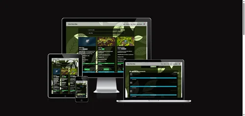

# Seed Shop Project

## Table of Contents

1. [Project Overview](#project-overview)
2. [Goals](#goals)
   1. [User Goals](#user-goals)
   2. [Owner Goals](#owner-goals)
3. [Features Overview](#features-overview)
4. [Possible Future Features](#possible-future-features)
5. [Marketing Strategy for Future Flower Shop](#marketing-strategy-for-future-flower-shop)
6. [Testing and Limitations](#testing-and-limitations)
   1. [Social Media Presence](#social-media-presence)
   2. [SEO Optimization](#seo-optimization)
   3. [Promotions & Special Offers](#promotions-special-offers)
   4. [Customer Engagement](#customer-engagement)
   5. [Future Marketing Goals](#future-marketing-goals)
7. [Agile Methodology Overview](#agile-methodology-overview)
8. [Project Structure](#project-structure)
9. [Labels for Navigation](#labels-for-navigation)
10. [Design & Aesthetic](#design-aesthetic)
11. [Color Palette](#color-palette)
12. [Technologies Used](#technologies-used)
13. [Deployment of the Future Flower Shop Project on Heroku](#deployment-of-the-future-flower-shop-project-on-heroku)
14. [What I Have Done](#what-i-have-done)
15. [Conclusion](#conclusion)
16. [Credits](#credits)
17. [Image and Icon Attributions](#image-and-icon-attributions)

## Project Overview

Future Flower Shop is a modern, fully responsive e-commerce platform designed for purchasing seeds and gardening products. Built with Django (Python) on the backend and JavaScript for interactive front-end elements, this application offers a seamless user experience with:

- **Secure User Authentication**: Ensuring user data protection and safe access.
- **Dynamic Search & Filtering**: Helping customers find products quickly and efficiently.
- **Stripe-Powered Checkout**: Enabling secure and hassle-free transactions.
- **Admin Dashboard**: Allowing for efficient management of products, including adding, editing, and deleting seeds, as well as approving or rejecting customer reviews and comments.
- **Newsletter Feature**: Facilitating direct communication with users.
- **Real-Time Messaging & Live Chat**: Enhancing customer support and engagement.

This platform provides a complete and user-friendly shopping experience for gardening enthusiasts, combining intuitive navigation with powerful management tools.

## Goals

### **User Goals**

1. **Effortless Navigation and Interaction**

   - Users should experience a dynamic and interactive navigation system that simplifies exploration of various seed categories and features.

2. **Instant Assistance and Support**

   - Provide immediate help through live chat, allowing users to quickly resolve queries and receive assistance.

3. **Informed Purchasing Decisions**

   - Offer detailed seed information and user-generated reviews to help users make well-informed purchasing decisions.

4. **Personalized and Convenient Experience**

   - Enable users to manage their accounts and track orders, for a customized shopping experience.

5. **Seamless and Secure Transactions**
   - Ensure a smooth checkout process with clear summaries and robust protection against data breaches and fraud.

### **Owner Goals**

1. **Enhanced User Engagement and Satisfaction**

   - Implement features that enhance user engagement, retention, and satisfaction, ensuring a memorable shopping experience.

2. **Operational Efficiency and Management**

   - Streamline backend processes for product management, order processing, and customer support to optimize efficiency and reduce overhead.

3. **Scalability and Performance**

   - Utilize scalable infrastructure to handle increasing traffic and demands, maintaining platform performance and responsiveness.

4. **Data Security and Compliance**

   - Implement strong security measures to protect user data and ensure compliance with relevant data protection regulations.

5. **Future-Proofing the Platform**
   - Develop a flexible system that can adapt to future technological advancements and evolving user needs.

## Features Overview

This project integrates several key features designed to enhance the Seed Shop platform:

1. [Dynamic Navigation Menu](documentation/features.md#1-dynamic-navigation-menu)
2. [Advanced Cart Management](documentation/features.md#2-cart-page)
3. [Comprehensive Seed Details](documentation/features.md#5-seed-details-review-comments-and-rating-system)
4. [Custom Account Management](documentation/features.md#4-custom-account-management)
5. [Review and Rating System](documentation/features.md#5-seed-details-review-comments-and-rating-system)
6. [Chat and Chatbot Integration](documentation/features.md#6-chat-system)
7. [Seamless Checkout Process](documentation/features.md#8-checkout-page-template)
8. [Responsive and Secure Design](documentation/features.md#8-checkout-page-template)
9. [Admin Dashboard](documentation/features.md#7-admin-dashboard)

For a comprehensive description of each feature, including technical details and implementation, please refer to the
[Features Documentation](documentation/features.md).

## Possible Future Features

To keep the Seed Shop platform innovative and aligned with emerging user needs, we are exploring the following potential enhancements:

### 1. Voice Command Navigation

- **Objective**: Improve accessibility for visually impaired users.
- **Description**: Integrate voice recognition to allow users to navigate the platform using voice commands, enhancing accessibility and convenience.

### 2. Advanced Personalization

- **Objective**: Offer personalized shopping experiences.
- **Description**: Utilize machine learning to provide personalized product recommendations based on user behavior and preferences.

### 3. Augmented Reality (AR) Integration

- **Objective**: Enhance product visualization.
- **Description**: Implement AR features to allow users to visualize how seeds and plants will appear in their environment.

### 4. Expanded Chatbot Capabilities

- **Objective**: Improve chatbot functionality.
- **Description**: Enhance the chatbot’s NLP abilities to handle a wider range of queries and perform advanced tasks like order tracking and plant care advice.

### 5. Social Media Integration

- **Objective**: Increase user engagement through social media.
- **Description**: Integrate social media features for content sharing, login options, and targeted marketing.

### 6. Enhanced Analytics and Reporting

- **Objective**: Provide data-driven insights.
- **Description**: Develop advanced analytics and reporting tools to monitor user behavior, sales performance, and platform metrics.

For detailed information about these future features and their potential impact, please refer to the [Future Features Documentation](documentation/future-features.md).

## Marketing Strategy for Future Flower Shop

## Testing and Limitations

Due to being sick for 20 days, detailed testing of the platform could not be completed as planned. The testing process will be finalized after the assessment by Code Institute and the completion of grading. However, the application has been tested for its core functionality and is fully operational. All essential features, such as product browsing, cart management, and checkout, have been verified and work as expected. Please note that the management features (admin dashboard and certain backend operations) were not fully tested, but no critical issues have been identified within the customer-facing components.

For more information on features and testing, please refer to the [Testing Documentation](documentation/testing.md).

### Social Media Presence

We will maintain an active **Facebook page** to engage with our community of gardening enthusiasts, share seasonal promotions, and provide expert gardening tips. Our Facebook page will help us connect with customers and grow our online presence. Users will be able to follow us for the latest updates on new seed arrivals, special discounts, and valuable gardening advice.

  
_Image of our Facebook page_

### SEO Optimization

We will implement robust **SEO strategies** to enhance the visibility of Future Flower Shop in search engines. Our on-site SEO will be built around **dynamic meta descriptions** and **keywords** tailored to the specific products and categories offered on the platform. The following SEO strategies will be in place:

- **Meta Descriptions:** Each page will include a unique meta description that provides a compelling reason for customers to visit, such as, "Learn how to grow beautiful roses from seeds with our step-by-step guide" or "Discover expert tips for rose seed germination."
- **Dynamic Meta Keywords:** Keywords such as “buy seeds online,” “Future Flower Shop,” and “gardening seeds” will be included for each product page, helping to increase the likelihood of appearing in relevant search results.

- **Customizable SEO for Individual Products:** Each product page will have its own meta description, ensuring that specific keywords related to the seed or plant category are emphasized. For example, for rose seeds, the description might mention **scientific names** and **specific seed categories**, making it easier for users to find relevant products.

### Promotions & Special Offers

We will run **seasonal promotions** on our Facebook page to drive traffic to the site and increase sales. This will include **discounts**, **special deals on bulk seed purchases**, and **limited-time offers** that encourage repeat visits. These promotions will be supported by SEO-driven content, such as blog posts and product updates, ensuring that customers are always in the loop.

### Customer Engagement

By leveraging SEO and social media, we aim to foster **long-term customer relationships**. Features like customer reviews and ratings on products will be part of our strategy to build trust and social proof. The more customers engage with us online, the more likely they will share their experiences, which will further boost our visibility on search engines and social media.

### Future Marketing Goals

To ensure we stay ahead of the competition and keep our customers engaged, we will continually improve our marketing strategy by:

- Enhancing our **content marketing** efforts with more informative blog posts and guides on gardening, plant care, and seed cultivation.
- Expanding our **social media presence** by integrating features like social media sharing buttons and offering exclusive promotions for followers.
- Implementing **personalized marketing** through email campaigns and tailored recommendations based on user behavior.

By combining SEO, content marketing, and social media engagement, Future Flower Shop will attract and retain a dedicated customer base, while providing valuable resources to gardening enthusiasts worldwide.

## Agile Methodology Overview

This project follows Agile methodology to ensure iterative development and adaptability. By breaking down the project into epics, user stories, and tasks, we maintain a flexible and organized approach to development.

## Project Structure

The project is organized into **6 epics**, with **22 user stories** and **30 tasks** to detail the development process.

**Epics Overview:**

- [**Cart Management System**](documentation/agile.md#epic-cart-management-system)
- [**Navigation and Filtering System**](documentation/agile.md#epic-navigation-and-filtering-system)
- [**Stripe Integration and Checkout System**](documentation/agile.md#epic-stripe-integration-and-checkout-system)
- [**Custom Account Integration**](documentation/agile.md#epic-custom-account-integration)
- [**Seed Details and Seed List Functionality**](documentation/agile.md#epic-seed-details-and-seed-list-functionality)
- [**Communication Channels and Support**](documentation/agile.md#epic-communication-channels-and-support)

For a detailed breakdown of epics, user stories, and tasks, refer to the [Agile Documentation](documentation/agile.md).

## Labels for Navigation

Labels have been created for each epic to facilitate quick navigation through the documentation:

- **Epic: Communication Channels and Support**
- **Epic: Seed Details and Seed List Functionality**
- **Epic: Custom Account Integration**
- **Epic: Stripe Integration and Checkout System**
- **Epic: Navigation and Filtering System**
- **Epic: Cart Management System**

Refer to the [Agile Documentation](documentation/agile.md) for a comprehensive overview of these epics and their components.

## Design & Aesthetic

### Color Palette

Our color palette reflects the natural, earthy tones of nature:

### Gradient Colors:

- **Primary Color**:  `#415b17` (Dark Olive Green) - A deep, earthy green that evokes nature and rustic environments.  
  [View on ColorHexa](https://www.colorhexa.com/415b17)

- **Secondary Color**:  `#649650` (Olive Green) - A soft, natural green that complements the deeper tones, adding balance and harmony.  
  [View on ColorHexa](https://www.colorhexa.com/649650)

- **Text Color**:  `#FFFFFF` (White) - Used for all text elements, ensuring clarity and readability against darker backgrounds.  
  [View on ColorHexa](https://www.colorhexa.com/ffffff)

- **ErrorColor**:  `#DC3545` (Bootstrap Red) - Used for error messages to alert users of issues or incorrect input.  
  [View on ColorHexa](https://www.colorhexa.com/dc3545)

---

## Technologies Used

- **Django**: Backend framework.
- **HTML/CSS/JS**: Frontend technologies for a responsive and modern UI.
- **Stripe API**: Secure payment processing.
- **Heroku**: Hosting platform for scalability.
- **Photoshop**: Graphic design and image editing for marketing and branding materials.
- **ChatGPT**: AI-powered chatbot integrated for customer support and personalized recommendations.

## Deployment of the **Future Flower Shop** Project on Heroku

### What I Have Done

I have successfully deployed the **Future Flower Shop** project to **Heroku** using the **Heroku Dashboard**. Here’s an overview of the steps I followed to get the project running live on Heroku without using the terminal:

#### 1. **Created a Heroku Account**

First, I created an account on Heroku by visiting [Heroku’s official website](https://www.heroku.com/). This allowed me to access the Heroku Dashboard and start managing my applications.

#### 2. **Cloned the Project Repository**

I cloned the **Future Flower Shop** project repository from GitHub to my local machine using Git, just like before. This gave me the project files, but all the deployment setup was done through the Heroku Dashboard instead of the terminal.

#### 3. **Created a New Heroku Application**

In the **Heroku Dashboard**, I clicked on **Create New App**. I gave my app a name, and Heroku automatically assigned a unique URL for it. I chose a name for the app and selected the region (default is fine for most use cases).

#### 4. **Connected My GitHub Repository to Heroku**

In the Heroku Dashboard, under the **Deploy** tab, I connected my GitHub repository to the Heroku app. By doing this, I allowed Heroku to directly access my GitHub repository for deployment.

#### 5. **Enabled Automatic Deploys**

I configured Heroku to automatically deploy my app whenever I pushed updates to the GitHub repository. This was done by enabling **Automatic Deploys** in the **Deploy** tab, ensuring my app is always up-to-date with the latest changes on GitHub.

#### 6. **Set Environment Variables**

I went to the **Settings** tab on the Heroku Dashboard and added the necessary environment variables in the **Config Vars** section. These variables included secret keys, API keys, and any other sensitive data the project required to run properly.

#### 7. **Manually Deployed the Code**

After linking my GitHub repository to Heroku and configuring automatic deploys, I manually triggered the first deployment by clicking on **Deploy Branch**. This allowed Heroku to pull the latest code from my GitHub repository and deploy the app to the web.

#### 8. **Monitored the Application**

Once the deployment was complete, I could monitor the app directly from the **Heroku Dashboard**. I accessed the app's logs through the **Logs** section in the dashboard, which helped me ensure that everything was running smoothly and gave me the ability to troubleshoot any issues that arose.

#### 9. **Opened the Application**

Finally, after the successful deployment, I opened the application in the browser directly from the Heroku Dashboard by clicking on the **Open App** button.

---

### Conclusion

By using the **Heroku Dashboard**, I was able to easily deploy the **Future Flower Shop** project without using the terminal. The Heroku Dashboard provided a user-friendly interface to manage the application, set up environment variables, connect to GitHub, and monitor the app. Now, the project is live and can be accessed by anyone via its Heroku-provided URL.

## Credits

- **[ChatGPT](https://openai.com/chatgpt)**: Thanks to [OpenAI](https://openai.com) for providing the ChatGPT model, which has been instrumental in generating code snippets, refining content, and brainstorming ideas throughout the process of creating this project.
- **Brian O'Hare**: A special thanks to my mentor, Brian O'Hare, whose invaluable guidance and feedback helped shape the direction of this project from the initial concept to its completion.

- **Code Institute**: I used various walkthroughs and code snippets from Code Institute, especially for Stripe integration and webhook setup, which were crucial for implementing the payment processing system and other backend functionalities effectively.

---

## Image and Icon Attributions

The following images and icons were used in the production of this project. Their work was integral to the final product:

# Credits

- **Image by [Oleksandr K](https://pixabay.com/users/gidlark01-45195753/?utm_source=link-attribution&utm_medium=referral&utm_campaign=image&utm_content=8940207)** from [Pixabay](https://pixabay.com//?utm_source=link-attribution&utm_medium=referral&utm_campaign=image&utm_content=8940207)
- **Image by [NoPixelZone](https://pixabay.com/users/nopixelzone-6025194/?utm_source=link-attribution&utm_medium=referral&utm_campaign=image&utm_content=7386611)** from [Pixabay](https://pixabay.com//?utm_source=link-attribution&utm_medium=referral&utm_campaign=image&utm_content=7386611)
- [Nasturtium icons created by iconixar - Flaticon](https://www.flaticon.com/free-icons/nasturtium)
- **Image by [NoName_13](https://pixabay.com/users/noname_13-2364555/?utm_source=link-attribution&utm_medium=referral&utm_campaign=image&utm_content=1420050)** from [Pixabay](https://pixabay.com//?utm_source=link-attribution&utm_medium=referral&utm_campaign=image&utm_content=1420050)
- **Image by [👀 Mabel Amber, who will one day](https://pixabay.com/users/mabelamber-1377835/?utm_source=link-attribution&utm_medium=referral&utm_campaign=image&utm_content=4116159)** from [Pixabay](https://pixabay.com//?utm_source=link-attribution&utm_medium=referral&utm_campaign=image&utm_content=4116159)
- **Image by [Marjon Besteman](https://pixabay.com/users/marjonhorn-3698690/?utm_source=link-attribution&utm_medium=referral&utm_campaign=image&utm_content=5741798)** from [Pixabay](https://pixabay.com//?utm_source=link-attribution&utm_medium=referral&utm_campaign=image&utm_content=5741798)
- **Image by [🌼Christel🌼](https://pixabay.com/users/chiemseherin-1425977/?utm_source=link-attribution&utm_medium=referral&utm_campaign=image&utm_content=4411108)** from [Pixabay](https://pixabay.com//?utm_source=link-attribution&utm_medium=referral&utm_campaign=image&utm_content=4411108)
- **Image by [Angeles Balaguer](https://pixabay.com/users/angeleses-4701261/?utm_source=link-attribution&utm_medium=referral&utm_campaign=image&utm_content=3469744)** from [Pixabay](https://pixabay.com//?utm_source=link-attribution&utm_medium=referral&utm_campaign=image&utm_content=3469744)
- **Image by [Nicky ❤️🌿🐞🌿❤️](https://pixabay.com/users/nickype-10327513/?utm_source=link-attribution&utm_medium=referral&utm_campaign=image&utm_content=7155187)** from [Pixabay](https://pixabay.com//?utm_source=link-attribution&utm_medium=referral&utm_campaign=image&utm_content=7155187)
- **Image by [hartono subagio](https://pixabay.com/users/ignartonosbg-21428489/?utm_source=link-attribution&utm_medium=referral&utm_campaign=image&utm_content=6784088)** from [Pixabay](https://pixabay.com//?utm_source=link-attribution&utm_medium=referral&utm_campaign=image&utm_content=6784088)
- **Image by [Helga Kattinger](https://pixabay.com/users/helgaka-2849566/?utm_source=link-attribution&utm_medium=referral&utm_campaign=image&utm_content=6279832)** from [Pixabay](https://pixabay.com//?utm_source=link-attribution&utm_medium=referral&utm_campaign=image&utm_content=6279832)
- **Image by [juicy_fish on Freepik](https://www.freepik.com/free-vector/cart-add-remove_234683649.htm#fromView=search&page=1&position=10&uuid=3b93ed89-db7c-423b-bad4-38c91464e546)**
- **Image by [wirestock on Freepik](https://www.freepik.com/free-photo/selective-focus-shot-two-raspberries-bush_17244076.htm#fromView=search&page=1&position=3&uuid=0b252e7b-ad7b-447f-b23b-86e1c6c4d698)**
- **Image by [freepik on Freepik](https://www.freepik.com/free-photo/yellow-citrus-lemon-fruits-tree-branch-with-green-leaves-garden-closeup_36152681.htm#fromView=search&page=1&position=5&uuid=457ba5d8-0153-4206-b70b-e5ad8bb096da)**
- **Image by [Couleur on Pixabay](https://pixabay.com/users/couleur-1195798/?utm_source=link-attribution&utm_medium=referral&utm_campaign=image&utm_content=3535510)**
- **Image by [Ralph on Pixabay](https://pixabay.com/users/ralphs_fotos-1767157/?utm_source=link-attribution&utm_medium=referral&utm_campaign=image&utm_content=3506327)**
- **Image by [Mabel Amber, who will one day on Pixabay](https://pixabay.com/users/mabelamber-1377835/?utm_source=link-attribution&utm_medium=referral&utm_campaign=image&utm_content=3865041)**
- **Image by [Rattakarn on Pixabay](https://pixabay.com/users/rattakarn_-4633491/?utm_source=link-attribution&utm_medium=referral&utm_campaign=image&utm_content=6799477)**
- **Image by [Angela on Pixabay](https://pixabay.com/users/vampy24-665293/?utm_source=link-attribution&utm_medium=referral&utm_campaign=image&utm_content=598170)**
- **Image by [Inna on Pixabay](https://pixabay.com/users/salgir-10800086/?utm_source=link-attribution&utm_medium=referral&utm_campaign=image&utm_content=7395624)**
- **Image by [hartono subagio on Pixabay](https://pixabay.com/users/ignartonosbg-21428489/?utm_source=link-attribution&utm_medium=referral&utm_campaign=image&utm_content=7878583)**
- **Image by [Leopictures on Pixabay](https://pixabay.com/users/ulleo-1834854/?utm_source=link-attribution&utm_medium=referral&utm_campaign=image&utm_content=1627193)**
- **Image by [Marion Zanger on Pixabay](https://pixabay.com/users/est-manag-concept-18603496/?utm_source=link-attribution&utm_medium=referral&utm_campaign=image&utm_content=5633474)**
