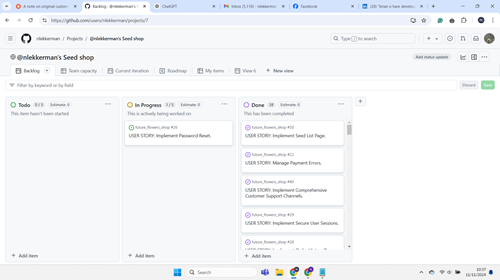

# Agile Project Management for Seed Shop

# Table of Contents

1. [Epic: Cart Management System](#epic-cart-management-system)  
   1.1. [US01: Implement Add to Cart Functionality](#us01-implement-add-to-cart-functionality)  
   1.2. [US02: Implement View Cart Page](#us02-implement-view-cart-page)  
   1.3. [US03: Implement Update Cart Items](#us03-implement-update-cart-items)  
   1.4. [US04: Implement Remove Cart Items](#us04-implement-remove-cart-items)  
   1.5. [US05: Implement Cart Persistence](#us05-implement-cart-persistence)

2. [Epic: Navigation and Filtering System](#epic-navigation-and-filtering-system)  
   2.1. [US01: Implement Main Navigation Menu](#us01-implement-main-navigation-menu)  
   2.2. [US02: Implement Category Filtering](#us02-implement-category-filtering)  
   2.3. [US03: Implement Search Functionality](#us03-implement-search-functionality)  
   2.4. [US04: Implement Sorting Options](#us04-implement-sorting-options)  
   2.5. [US05: Optimize Navigation for Mobile](#us05-optimize-navigation-for-mobile)

3. [Epic: Stripe Integration and Checkout System](#epic-stripe-integration-and-checkout-system)  
   3.1. [US01: Implement Stripe Payment Gateway](#us01-implement-stripe-payment-gateway)  
   3.2. [US02: Create Checkout Page](#us02-create-checkout-page)  
   3.3. [US03: Implement Order Confirmation Page](#us03-implement-order-confirmation-page)  
   3.4. [US04: Implement Payment Error Handling](#us04-implement-payment-error-handling)  
   3.5. [US05: Implement Payment Confirmation Emails](#us05-implement-payment-confirmation-emails)  
   3.6. [US06: Ensure PCI Compliance](#us06-ensure-pci-compliance)

4. [Epic: Custom Account Integration](#epic-custom-account-integration)  
   4.1. [US01: Implement User Registration](#us01-implement-user-registration)  
   4.2. [US02: Implement User Login](#us02-implement-user-login)  
   4.3. [US03: Implement Password Reset Functionality](#us03-implement-password-reset-functionality)  
   4.4. [US04: Implement User Profile Management](#us04-implement-user-profile-management)  
   4.5. [US05: Implement Account Settings Management](#us05-implement-account-settings-management)  
   4.6. [US06: Implement User Account Security Features](#us06-implement-user-account-security-features)

5. [Epic: Seed Details and Seed List Functionality](#epic-seed-details-and-seed-list-functionality)  
   5.1. [US01: Implement Seed List Page](#us01-implement-seed-list-page)  
   5.2. [US02: Implement Seed Detail Page](#us02-implement-seed-detail-page)  
   5.3. [US03: Implement Related Seeds Section](#us03-implement-related-seeds-section)  
   5.4. [US04: Implement Seed Availability Indicator](#us04-implement-seed-availability-indicator)  
   5.5. [US05: Implement Seed Search and Filter Options](#us05-implement-seed-search-and-filter-options)  
   5.6. [US06: Implement Seed Comparison Feature](#us06-implement-seed-comparison-feature)  
   5.7. [US07: Implement User Ratings and Reviews for Seeds](#us07-implement-user-ratings-and-reviews-for-seeds)

6. [Epic: Communication Channels and Support](#epic-communication-channels-and-support)  
   6.1. [US01: Display Seed Ratings and Reviews](#us01-display-seed-ratings-and-reviews)  
   6.2. [US02: Submit Seed Reviews and Ratings](#us02-submit-seed-reviews-and-ratings)  
   6.3. [US03: Implement Review Moderation](#us03-implement-review-moderation)  
   6.4. [US04: Implement Chatbot for Customer Support](#us04-implement-chatbot-for-customer-support)  
   6.5. [US05: Enable Live Chat with Customer Support](#us05-enable-live-chat-with-customer-support)  
   6.6. [US06: Implement Review and Rating Analytics](#us06-implement-review-and-rating-analytics)

This document outlines the epics, user stories, and tasks for the Seed Shop project. Each epic includes detailed user stories and tasks that contribute to achieving the epic's goals.

## Epic: Cart Management System
**Epic #1**

**Description:** This epic deals with the management of the shopping cart. It includes functionalities for adding, viewing, updating, and removing items from the cart, as well as completing the checkout process.

### User Stories and Tasks:

- **[US01: Implement Add to Cart Functionality](#us01-implement-add-to-cart-functionality)**
  - **Acceptance Criteria:**
    - Users can add items to the cart from the product detail page.
    - The cart updates in real-time to reflect added items.
    - Cart updates persist across sessions if the user is logged in.
  - **Tasks:**
    - Develop the "Add to Cart" button functionality.
    - Implement backend logic to handle cart item additions.
    - Create unit tests for adding items to the cart.

- **[US02: Implement View Cart Page](#us02-implement-view-cart-page)**
  - **Acceptance Criteria:**
    - The cart page displays all items currently in the cart.
    - Users can view item details, update quantities, and remove items.
    - The cart reflects accurate totals and updates correctly.
  - **Tasks:**
    - Design the cart view page layout.
    - Implement the display of cart items and their details.
    - Add functionality to update item quantities and remove items.
    - Test the cart view page for usability and bugs.

- **[US03: Implement Update Cart Items](#us03-implement-update-cart-items)**
  - **Acceptance Criteria:**
    - Users can adjust the quantity of items in the cart.
    - Cart totals update dynamically as quantities are changed.
    - Updates are correctly reflected in the backend.
  - **Tasks:**
    - Develop functionality for updating item quantities in the cart.
    - Implement backend logic to reflect changes in the cart.
    - Create tests to ensure accurate updating of cart items.

- **[US04: Implement Remove Cart Items](#us04-implement-remove-cart-items)**
  - **Acceptance Criteria:**
    - Users can remove individual items from the cart.
    - The cart updates in real-time to reflect removed items.
    - The removal process does not affect other items in the cart.
  - **Tasks:**
    - Develop functionality for removing items from the cart.
    - Implement backend logic to handle item removal.
    - Test the removal process to ensure correct item deletion.

- **[US05: Implement Cart Persistence](#us05-implement-cart-persistence)**
  - **Acceptance Criteria:**
    - Cart contents are preserved across user sessions if logged in.
    - Users can access their cart from any device when logged in.
    - Cart state is consistent across different sessions and devices.
  - **Tasks:**
    - Implement functionality to save the cart state between sessions.
    - Develop logic to handle cart persistence in user accounts.
    - Test cart persistence across different devices and sessions.

## Epic: Navigation and Filtering System
**Epic #2**

**Description:** This epic focuses on improving the navigation and filtering capabilities of the Seed Shop platform. It includes features for better product discovery, including search, filtering, and sorting options, to enhance the user’s browsing experience.

### User Stories and Tasks:

- **[US01: Implement Main Navigation Menu](#us01-implement-main-navigation-menu)**
  - **Acceptance Criteria:**
    - The main navigation menu is accessible from all pages.
    - The menu includes links to major sections and categories.
    - The menu is responsive and works well on different devices.
  - **Tasks:**
    - Design the main navigation menu layout.
    - Implement menu links and dropdowns.
    - Test navigation for usability and responsiveness.

- **[US02: Implement Category Filtering](#us02-implement-category-filtering)**
  - **Acceptance Criteria:**
    - Users can filter products by category on the product list page.
    - Filtering options are clearly visible and accessible.
    - Filters apply correctly and update the product list accordingly.
  - **Tasks:**
    - Develop the category filtering options.
    - Implement backend logic to filter products by category.
    - Test category filters to ensure accurate product display.

- **[US03: Implement Search Functionality](#us03-implement-search-functionality)**
  - **Acceptance Criteria:**
    - Users can enter search terms to find products.
    - Search results are relevant and match user queries.
    - The search bar is prominently placed and easy to use.
  - **Tasks:**
    - Develop the search bar functionality.
    - Implement search algorithm for finding products.
    - Test search results for accuracy and relevance.

- **[US04: Implement Sorting Options](#us04-implement-sorting-options)**
  - **Acceptance Criteria:**
    - Users can sort products by criteria such as price, popularity, or rating.
    - Sorting options are available on the product list page.
    - Sorted results match the selected criteria accurately.
  - **Tasks:**
    - Design sorting options (e.g., price, popularity).
    - Implement sorting functionality in the product list.
    - Test sorting options to ensure correct product order.

- **[US05: Optimize Navigation for Mobile](#us05-optimize-navigation-for-mobile)**
  - **Acceptance Criteria:**
    - Navigation elements are optimized for mobile devices.
    - The mobile navigation menu is user-friendly and easy to interact with.
    - Navigation remains clear and functional on various mobile screen sizes.
  - **Tasks:**
    - Design mobile-friendly navigation layout.
    - Implement responsive design for navigation elements.
    - Test navigation on various mobile devices and screen sizes.

## Epic: Stripe Integration and Checkout System
**Epic #3**

**Description:** This epic focuses on integrating a secure and efficient payment system into the Seed Shop. It includes the implementation of the Stripe payment gateway and related checkout functionalities to ensure smooth and reliable transactions.

### User Stories and Tasks:

- **[US01: Implement Stripe Payment Gateway](#us01-implement-stripe-payment-gateway)**
  - **Acceptance Criteria:**
    - Stripe payment gateway is integrated and functional.
    - Users can complete payments securely through Stripe.
    - Payment transactions are processed accurately and reliably.
  - **Tasks:**
    - Set up Stripe account and configure API keys.
    - Implement Stripe payment integration.
    - Test payment transactions for accuracy and security.

- **[US02: Create Checkout Page](#us02-create-checkout-page)**
  - **Acceptance Criteria:**
    - The checkout page allows users to review cart items and enter payment details.
    - The page is user-friendly and guides users through the checkout process.
    - The checkout process completes successfully and confirms the order.
  - **Tasks:**
    - Design the checkout page layout.
    - Implement functionality for reviewing cart items and entering payment details.
    - Test the checkout process for usability and correctness.

- **[US03: Implement Order Confirmation Page](#us03-implement-order-confirmation-page)**
  - **Acceptance Criteria:**
    - Users receive an order confirmation page after completing the checkout.
    - The confirmation page displays order details and a confirmation message.
    - Users are provided with options to view their order history or return to shopping.
  - **Tasks:**
    - Design the order confirmation page layout.
    - Implement functionality to display order details and confirmation message.
    - Test the confirmation page for accuracy and user experience.

- **[US04: Implement Payment Error Handling](#us04-implement-payment-error-handling)**
  - **Acceptance Criteria:**
    - Users receive appropriate error messages if payment fails.
    - Payment errors are logged and can be reviewed by administrators.
    - Users are guided through steps to resolve payment issues.
  - **Tasks:**
    - Develop error handling for payment failures.
    - Implement user notifications and guidance for resolving payment issues.
    - Test error handling to ensure correct user feedback and issue resolution.

- **[US05: Implement Payment Confirmation Emails](#us05-implement-payment-confirmation-emails)**
  - **Acceptance Criteria:**
    - Users receive email confirmations for successful payments.
    - Confirmation emails include order details and payment summary.
    - Emails are sent promptly after the payment is processed.
  - **Tasks:**
    - Set up email notifications for payment confirmations.
    - Design and implement email templates for order confirmation.
    - Test email delivery and content accuracy.

- **[US06: Ensure PCI Compliance](#us06-ensure-pci-compliance)**
  - **Acceptance Criteria:**
    - Payment processing adheres to PCI-DSS standards.
    - User payment information is securely handled and stored.
    - Compliance is regularly reviewed and updated as needed.
  - **Tasks:**
    - Review PCI-DSS standards and implement necessary security measures.
    - Conduct regular security audits to ensure compliance.
    - Document and address any compliance issues.

## Epic: Custom Account Integration
**Epic #4**

**Description:** This epic involves integrating custom account functionalities into the Seed Shop platform. It includes user account management features such as registration, login, profile management, and account settings.

### User Stories and Tasks:

- **[US01: Implement User Registration](#us01-implement-user-registration)**
  - **Acceptance Criteria:**
    - Users can register for a new account using their email and password.
    - Registration includes email verification for account activation.
    - Users receive a confirmation email upon successful registration.
  - **Tasks:**
    - Develop user registration form and backend logic.
    - Implement email verification process.
    - Create tests for registration functionality.

- **[US02: Implement User Login](#us02-implement-user-login)**
  - **Acceptance Criteria:**
    - Users can log in using their email and password.
    - Login process is secure and user credentials are protected.
    - Users receive appropriate error messages for invalid login attempts.
  - **Tasks:**
    - Develop user login functionality.
    - Implement security measures for password protection.
    - Test login process and error handling.

- **[US03: Implement Password Reset Functionality](#us03-implement-password-reset-functionality)**
  - **Acceptance Criteria:**
    - Users can request a password reset via email.
    - Password reset link is securely generated and expires after use.
    - Users can set a new password and log in with it.
  - **Tasks:**
    - Develop password reset request and processing functionality.
    - Implement secure link generation and expiration.
    - Test password reset process for security and usability.

- **[US04: Implement User Profile Management](#us04-implement-user-profile-management)**
  - **Acceptance Criteria:**
    - Users can view and edit their profile information.
    - Changes to profile details are saved and reflected in the account.
    - Users can update their email address and password.
  - **Tasks:**
    - Design and implement user profile management features.
    - Develop functionality for updating user information.
    - Test profile management for accuracy and security.

- **[US05: Implement Account Settings Management](#us05-implement-account-settings-management)**
  - **Acceptance Criteria:**
    - Users can manage their account settings, such as notification preferences and privacy settings.
    - Changes to account settings are saved and applied.
    - Users receive notifications about significant changes to their account settings.
  - **Tasks:**
    - Develop functionality for managing account settings.
    - Implement settings update and notification features.
    - Test account settings management for functionality and usability.

- **[US06: Implement User Account Security Features](#us06-implement-user-account-security-features)**
  - **Acceptance Criteria:**
    - User accounts are protected by secure authentication and authorization mechanisms.
    - Security features include two-factor authentication (if applicable) and account lockout after multiple failed login attempts.
    - Regular security reviews are conducted to identify and address vulnerabilities.
  - **Tasks:**
    - Implement secure authentication and authorization mechanisms.
    - Develop additional security features, such as two-factor authentication and account lockout.
    - Conduct security reviews and address identified issues.

## Epic: Seed Details and Seed List Functionality
**Epic #5**

**Description:** This epic covers the implementation of seed details and the seed list functionality. It includes displaying detailed information about each seed and creating a comprehensive list of available seeds.

### User Stories and Tasks:

- **[US01: Implement Seed List Page](#us01-implement-seed-list-page)**
  - **Acceptance Criteria:**
    - The seed list page displays all available seeds with brief descriptions.
    - Users can view seed names, images, and prices on the list.
    - Pagination or infinite scroll is implemented for large seed lists.
  - **Tasks:**
    - Design the seed list page layout.
    - Implement the display of seed names, images, and prices.
    - Develop pagination or infinite scroll functionality.
    - Test seed list page for usability and performance.

- **[US02: Implement Seed Detail Page](#us02-implement-seed-detail-page)**
  - **Acceptance Criteria:**
    - The seed detail page provides comprehensive information about each seed.
    - Users can view seed descriptions, images, and other relevant details.
    - The page includes options to add seeds to the cart or view similar products.
  - **Tasks:**
    - Design the seed detail page layout.
    - Implement functionality to display seed details and images.
    - Add features for adding seeds to the cart and viewing similar products.
    - Test seed detail page for completeness and accuracy.

- **[US03: Implement Related Seeds Section](#us03-implement-related-seeds-section)**
  - **Acceptance Criteria:**
    - Users can view related seeds based on the current seed's category or characteristics.
    - Related seeds are displayed in a dedicated section on the seed detail page.
    - The section is updated dynamically based on the current seed.
  - **Tasks:**
    - Develop functionality to display related seeds on the seed detail page.
    - Implement logic to determine related seeds based on categories or characteristics.
    - Test the related seeds section for relevance and accuracy.

- **[US04: Implement Seed Availability Indicator](#us04-implement-seed-availability-indicator)**
  - **Acceptance Criteria:**
    - The seed detail page includes an indicator for seed availability (e.g., in stock, out of stock).
    - Availability status is updated in real-time based on inventory levels.
    - Users are notified of availability status before adding seeds to the cart.
  - **Tasks:**
    - Develop functionality to display seed availability indicators.
    - Implement real-time updates for inventory levels.
    - Test availability indicators for accuracy and usability.

- **[US05: Implement Seed Search and Filter Options](#us05-implement-seed-search-and-filter-options)**
  - **Acceptance Criteria:**
    - Users can search for seeds using keywords and filter results by criteria such as category, price, or rating.
    - Search and filter options are clearly visible and accessible.
    - Results are accurately updated based on user search and filter selections.
  - **Tasks:**
    - Develop search and filter functionality for seeds.
    - Implement backend logic to handle search and filtering.
    - Test search and filter options for accuracy and performance.

- **[US06: Implement Seed Comparison Feature](#us06-implement-seed-comparison-feature)**
  - **Acceptance Criteria:**
    - Users can compare multiple seeds based on their attributes (e.g., price, ratings, features).
    - The comparison feature displays a side-by-side view of selected seeds.
    - Users can select seeds to compare from the seed list or detail pages.
  - **Tasks:**
    - Design and implement seed comparison functionality.
    - Develop logic to compare seed attributes and display results.
    - Test the comparison feature for usability and accuracy.

- **[US07: Implement User Ratings and Reviews for Seeds](#us07-implement-user-ratings-and-reviews-for-seeds)**
  - **Acceptance Criteria:**
    - Users can rate and review seeds on the seed detail page.
    - Ratings and reviews are displayed in a user-friendly format.
    - Users can view average ratings and read other users' reviews.
  - **Tasks:**
    - Develop functionality for submitting and displaying seed ratings and reviews.
    - Implement backend logic to handle and store user feedback.
    - Test ratings and reviews for accuracy and display.

## Epic: Communication Channels and Support
**Epic #6**

**Description:** This epic aims to enhance user interaction and support through various communication channels. It includes features for accessing reviews, ratings, and direct interaction methods such as chatbots and live support.

### User Stories and Tasks:

- **[US01: Display Seed Ratings and Reviews](#us01-display-seed-ratings-and-reviews)**
  - **Acceptance Criteria:**
    - Seed ratings and reviews are displayed on the seed detail page.
    - Users can view individual ratings, review summaries, and detailed comments.
    - The display is organized and easy to navigate.
  - **Tasks:**
    - Develop functionality to display seed ratings and reviews.
    - Implement backend logic to retrieve and format review data.
    - Test the ratings and reviews display for accuracy and usability.

- **[US02: Submit Seed Reviews and Ratings](#us02-submit-seed-reviews-and-ratings)**
  - **Acceptance Criteria:**
    - Users can submit their own reviews and ratings for seeds.
    - The submission process includes fields for rating, review text, and optional images.
    - Users receive confirmation upon successful submission.
  - **Tasks:**
    - Develop the review and rating submission form.
    - Implement backend logic to handle new reviews and ratings.
    - Test the submission process for functionality and validation.

- **[US03: Implement Review Moderation](#us03-implement-review-moderation)**
  - **Acceptance Criteria:**
    - Reviews and ratings are moderated to ensure quality and relevance.
    - Moderators can approve, reject, or edit reviews.
    - Users are notified if their review is moderated or rejected.
  - **Tasks:**
    - Develop review moderation tools and interfaces for administrators.
    - Implement backend logic for review approval and rejection.
    - Test moderation features for effectiveness and usability.

- **[US04: Implement Chatbot for Customer Support](#us04-implement-chatbot-for-customer-support)**
  - **Acceptance Criteria:**
    - An AI-driven chatbot provides instant assistance on the website.
    - The chatbot can handle common questions and direct users to relevant resources.
    - Users can escalate issues to live support if needed.
  - **Tasks:**
    - Develop and integrate the AI chatbot into the website.
    - Implement chatbot functionality for handling common queries.
    - Test chatbot performance and user interactions.

- **[US05: Enable Live Chat with Customer Support](#us05-enable-live-chat-with-customer-support)**
  - **Acceptance Criteria:**
    - Users can initiate live chat sessions with customer support representatives.
    - Live chat functionality includes real-time messaging and session history.
    - Support representatives can manage and respond to multiple chat sessions.
  - **Tasks:**
    - Develop and integrate live chat functionality into the website.
    - Implement real-time messaging and session management features.
    - Test live chat for reliability and user satisfaction.

- **[US06: Implement Review and Rating Analytics](#us06-implement-review-and-rating-analytics)**
  - **Acceptance Criteria:**
    - Analytics tools provide insights into review and rating trends.
    - Administrators can view aggregated data and generate reports.
    - Insights help in improving product quality and customer satisfaction.
  - **Tasks:**
    - Develop analytics tools for reviewing and rating data.
    - Implement reporting features for administrators.
    - Test analytics for accuracy and usefulness.

