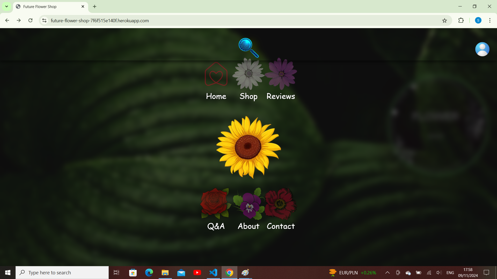
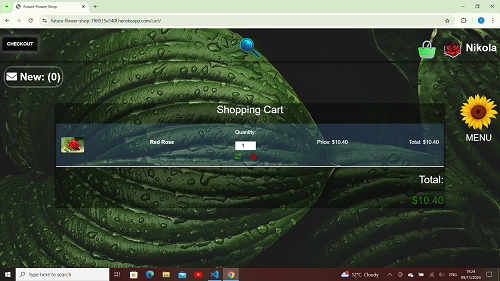
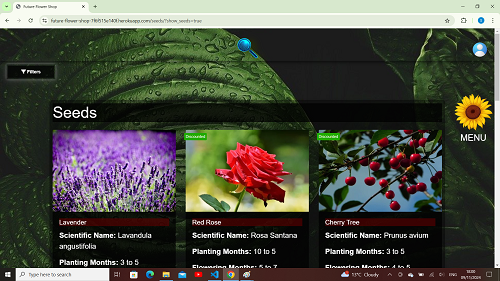
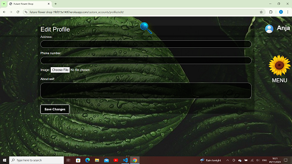
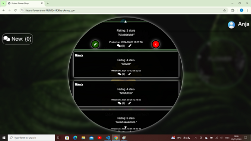

# Detailed Features Documentation

This document provides a comprehensive overview of the features implemented in the Seed Shop platform. It covers the functionality, user interactions, and technical aspects of each feature.

## Features Breakdown

### **1. Interactive Navigation Menu**

- **Description**: The home page features a flower-shaped button (`#menuIcon`) that toggles the visibility of navigation links (`.nav-link`). When the button is clicked, navigation links appear around the menu icon with a smooth animation effect.
- **Functionality**: 
  - **Toggle Nav Links**: Clicking the menu icon toggles the display of navigation links. Links animate into or out of view based on their current state.
  - **Positioning**: Links are arranged in a circular pattern around the menu icon, using CSS transformations for smooth positioning.

    ```
- **Image**: 

### **2. Advanced Cart Management**

- **Description**: The cart management system allows users to view and manage their cart with functionalities to add, update, and remove items.
- **Functionality**:
  - **Add to Cart**: Users can add items to their cart from the seed list page.
  - **Update Quantity**: Users can change item quantities directly from the cart.
  - **Remove Items**: Items can be removed from the cart.
  - **Total Calculation**: Displays the total cost and any applicable discounts.

- **Image**: 

### **3. Comprehensive Seed Details**

- **Description**: Each seed has a dedicated page displaying detailed information including scientific name, planting and flowering months, sun preferences, and price.
- **Functionality**:
  - **Detailed View**: Provides a thorough description of each seed.
  - **Add to Cart**: Users can select the quantity and add seeds to their cart.

- **Image**: 

### **4. Custom Account Management**

- **Description**: Users can create and manage their accounts, view order history, and save preferences for a personalized experience.
- **Functionality**:
  - **Account Creation**: Register new users.
  - **Profile Management**: Update personal details and preferences.
  - **Order History**: View past orders and track current ones.

- **Image**: 

### **5. Review and Rating System**

- **Description**: Users can leave reviews and rate seed products.
- **Functionality**:
  - **Submit Reviews**: Add feedback and ratings for seeds.
  - **View Reviews**: Read reviews from other users.

- **Image**: 

### **6. Chat and Chatbot Integration**

- **Description**: Integrates live chat and AI-driven chatbots for user support.
- **Functionality**:
  - **Live Chat**: Real-time support with human representatives.
  - **Chatbot**: AI-driven responses for FAQs and new user onboarding.

- **Chatbot was not implmented in this iteration**

### **7. Seamless Checkout Process**

- **Description**: Streamlines the checkout process with a clear overview of cart items, total cost, and discounts.
- **Functionality**:
  - **Checkout Overview**: Display items, quantities, and total price.
  - **Discounts**: Apply any available discounts before finalizing the purchase.

- **Image**: 

### **8. Responsive and Secure Design**

- **Description**: Ensures the platform is accessible across devices and integrates security features like CSRF protection.
- **Functionality**:
  - **Responsive Layout**: Adaptable design for different screen sizes.
  - **Security**: Protects user data and transactions.

- **Image**: 

### **9. Admin Dashboard**

- **Description**: An intuitive admin dashboard for managing products, orders, and user accounts. Provides insights into platform performance and allows for efficient backend operations.
- **Functionality**:
  - **Product Management**: Add, update, and remove seed products from the inventory.
  - **Order Management**: Track and manage customer orders.
  - **User Management**: View and manage user accounts and permissions.
  - **Performance Insights**: Access analytics on sales performance and user activity.

- **Image**: 
