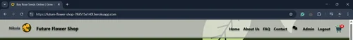
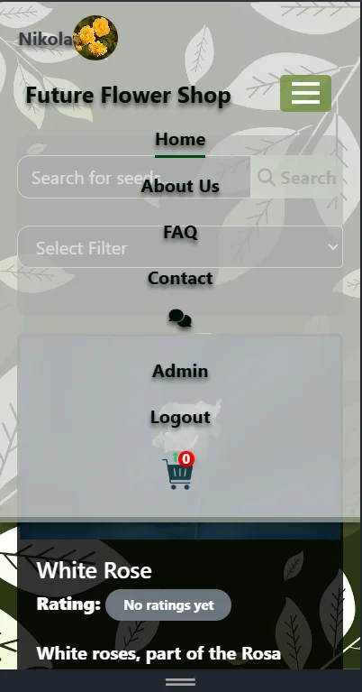
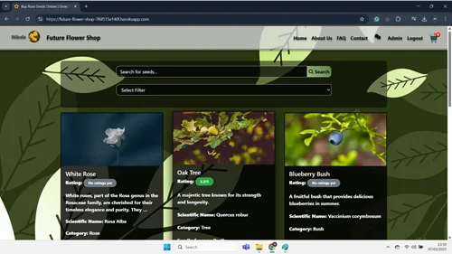
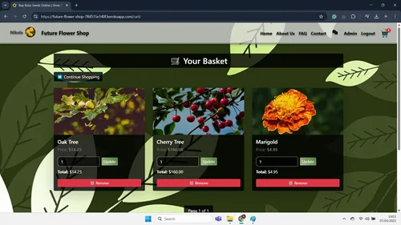
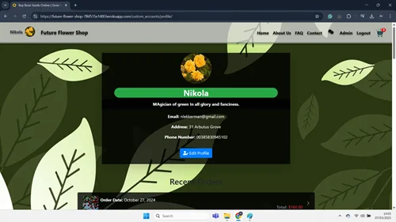
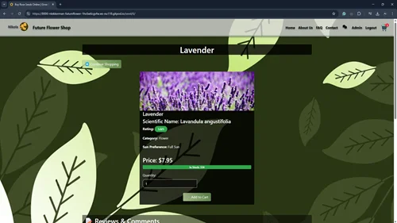
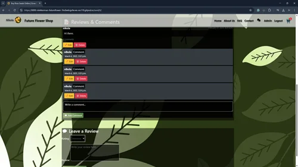
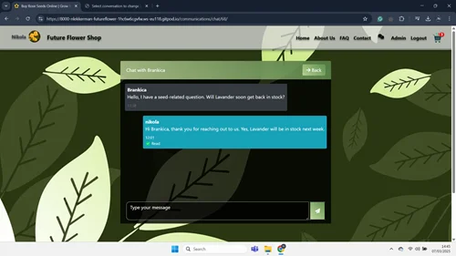
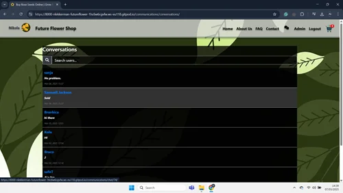
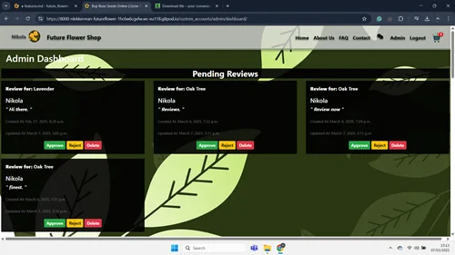

# Detailed Features Documentation

## Table of Contents

1. [Dynamic Navigation Menu](#1-dynamic-navigation-menu)
   - [Description](#11-description)
   - [Functionality](#12-functionality)
   - [Images](#14-images)
   - [Code Breakdown](#15-code-breakdown)
2. [Home Page](#2-home-page)
   - [Description](#21-description)
   - [Key Features](#22-key-features)
   - [Modals and Interactions](#23-modals-and-interactions)
   - [Code Breakdown](#24-code-breakdown)
   - [Image](#25-image)
   - [User Flow](#26-user-flow)
3. [Cart Page](#3-cart-page)
   - [Description](#31-description)
   - [Key Features](#32-key-features)
   - [Modals and Interactions](#33-modals-and-interactions)
   - [Code Breakdown](#34-code-breakdown)
   - [Image](#35-image)
   - [User Flow](#36-user-flow)
4. [Custom Account Management](#4-custom-account-management)
   - [Description](#41-description)
   - [Key Features](#42-key-features)
   - [Modals and Interactions](#43-modals-and-interactions)
   - [Code Breakdown](#44-code-breakdown)
   - [Image](#45-image)
   - [User Flow](#46-user-flow)
5. [Seed Details Review, Comments and Rating System](#5-seed-details-review-comments-and-rating-system)
   - [Description](#51-description)
   - [Key Features](#52-key-features)
   - [Modals and Interactions](#53-modals-and-interactions)
   - [Code Breakdown](#54-code-breakdown)
   - [User Flow](#55-user-flow)
   - [Image](#56-image)
   - [Review & Comment Features](#57-review-comment-features)
   - [Interaction Flow](#58-interaction-flow)
6. [Chat System](#6-chat-system)
   - [Admin-to-User Chat Interface](#61-admin-to-user-chat-interface)
   - [User-to-Admin Chat Interface](#62-user-to-admin-chat-interface)
   - [Admin Conversations List with Search](#63-admin-conversations-list-with-search)
7. [Admin Dashboard](#7-admin-dashboard)
   - [Admin Dashboard Overview](#71-admin-dashboard-overview)
   - [User Management](#72-user-management)
   - [Seed Listings Management](#73-seed-listings-management)
   - [Newsletter Management](#74-newsletter-management)
8. [Checkout Page Template](#8-checkout-page-template)
   - [Overview](#81-overview)
   - [Cart Items](#82-cart-items)
   - [Order Summary](#83-order-summary)
   - [Payment and Delivery Form](#84-payment-and-delivery-form)
   - [Example Links](#85-example-links)
   - [Template Features](#86-template-features)
9. [Order Success Page Template](#9-order-success-page-template)
   - [Order Confirmation](#91-order-confirmation)
   - [Order Items](#92-order-items)
   - [Delivery Information](#93-delivery-information)
   - [Billing Information](#94-billing-information)
   - [Action Button](#95-action-button)
   - [Template Features](#96-template-features)

## Features Breakdown

### **1. Dynamic Navigation Menu**

#### 1.1. Description:

The navigation bar is designed for a seamless, interactive user experience. For authenticated users, it displays the user’s profile with a profile picture and username. A dynamic **cart icon** shows the total number of unique items in the user's cart. Additionally, the navigation bar features a **new message badge**, which indicates the number of unread messages for the user, providing real-time notifications. The navigation menu is responsive, adapting to smaller screens with a hamburger toggle that reveals the menu links. On larger screens, all navigation options are visible for easy access to various pages such as Home, About Us, FAQ, Contact, and more.

#### 1.2. Functionality:

- **User Profile Display**: Authenticated users have their profile picture and username displayed, with a link to their profile page.
- **Navigation Links**: Key sections such as Home, About Us, FAQ, and Contact are easily accessible through the navigation links.
- **Cart Count**: The cart icon includes a badge that dynamically updates to show the number of unique items currently in the cart.
- **Unread Messages Count**: If there are unread messages, a badge appears on the messages icon to inform the user.
- **Responsive Design**: The navigation bar adapts for mobile and tablet devices. On smaller screens, a hamburger menu button appears, and clicking it reveals the menu options.
- **Logout Modal**: When clicking the Logout option, a confirmation modal appears to confirm whether the user wants to log out or stay logged in.
- **Admin Section**: For users with administrative privileges, an Admin link is shown for accessing the admin dashboard.

#### 1.4. Images:

---

#### 1.5. Code Breakdown:

The code provided renders a fully functional navbar with:

1. **User Profile Section**: Displays the username and profile image if the user is authenticated.
2. **Navbar Links**: Links to key sections like Home, About Us, FAQ, and Contact, all visible on larger screens.
3. **Cart Badge**: Shows the number of items in the cart, dynamically updated using `{{ total_unique_items }}`.
4. **Messages Icon with Unread Count**: Shows a badge with unread message count.
5. **Logout Modal**: Offers users a logout confirmation modal.
6. **Responsive Layout**: The menu adjusts with a hamburger toggle on small screens.

This structure ensures an intuitive user experience, combining both accessibility and dynamic features. Let me know if you'd like any further adjustments or clarifications!

### **2. Home Page**

#### 2.1. Description:

The home page allows users to browse, search, and filter through the available seeds. Key features include:

- **Search Bar**: Users can search for seeds by name.
- **Filter Options**: Users can filter seeds by discount, price (high to low or low to high), or newest/oldest seeds.
- **Seed Listings**: A grid of seed items, displaying images, names, ratings, descriptions, and prices (with discounts if applicable).
- **Stock Availability**: Seeds show their availability status (in stock or out of stock).
- **Add to Cart**: Users can select the quantity of seeds to add to their cart.
- **Pagination**: Allows users to navigate through multiple pages of seed listings.
- **Message Modal**: Displays messages and notifications (like successful addition to the cart).
- **Responsive Design**: The page is designed to be mobile-friendly and adjusts to different screen sizes.

#### 2.2. Key Features:

1. **Search Seeds**: Users can search for seeds by name using the search bar.
2. **Filter Seeds**: Users can filter seeds by different criteria such as discounted, price (high to low or low to high), and newest/oldest.
3. **Seed Listings**: Each seed is displayed in a card with an image, name, average rating, description, scientific name, and price (with or without a discount).
4. **Stock Availability**: Displays if the seed is in stock and the available quantity.
5. **Add to Cart**: Users can add seeds to the cart by selecting a quantity if the seed is in stock.
6. **Pagination**: Pagination controls allow users to navigate through multiple pages of seeds.
7. **Message Modal**: A modal shows notifications, such as success messages when seeds are added to the cart.

#### 2.3. Modals and Interactions:

1. **Message Modal**:

   - **Notification**: Displays any messages (such as success or error messages) related to actions like adding seeds to the cart.
   - **Action**: The modal can be closed by the user once they’ve read the message.

2. **Add to Cart Modal (Trigger)**:
   - **Confirmation**: A visual cue (like a shake animation) is displayed on the cart icon when an item is added to the cart.
   - **Action**: The cart icon performs a shake animation as feedback for the action.

#### 2.4. Code Breakdown:

- **Search Bar**: The search bar allows users to filter seeds by name in real-time.
- **Filter Dropdown**: Users can select various filters like discounted seeds, price sorting, or newest/oldest items.
- **Seed Cards**: Each seed is presented in a card with its image, name, description, scientific name, category, and price.
- **Stock and Add to Cart**: Seeds show their stock availability. If in stock, users can add them to their cart with a quantity selector.
- **Pagination Controls**: Pagination links are included to navigate between multiple pages of seeds.
- **Message Modal**: Displays any system messages or alerts.

#### 2.5. Image:

---

#### 2.6. User Flow:

1. Users visit the home page and see a list of seeds displayed with images, names, descriptions, and prices.
2. They can filter the seeds using the search bar or the dropdown filter.
3. If they wish to purchase a seed, they can select the quantity and add it to their cart if it is in stock.
4. Users can navigate through pages of seeds using pagination controls.
5. Any actions like adding a seed to the cart trigger a message modal, and the cart icon performs a shake animation as visual feedback.

### **3. Cart Page**

#### 3.1. Description:

The cart page allows users to view and manage the items in their shopping basket. Key features include:

- **Item Display**: Each cart item is shown with its image, name, price (after discount), quantity, and total price.
- **Quantity Update**: Users can update the quantity of any item directly from the cart.
- **Item Removal**: Items can be removed, with a confirmation modal to prevent accidental deletions.
- **Pagination**: For better organization, the cart items are paginated to display 3 items per page.
- **Order Summary**: The page includes a summary of the total price, applicable discounts, delivery fees, and the grand total.
- **Checkout Button**: A button is provided to proceed to checkout, where users can finalize their purchase.

#### 3.2. Key Features:

1. **View Cart Items**: Users can see all items added to their cart, including the seed image, name, price (after discount), and quantity.
2. **Update Cart Quantity**: Users can adjust the quantity of each item directly in the cart. The total for each item will update accordingly.
3. **Remove Item**: A "Remove" button opens a modal asking for confirmation before removing the item from the cart.
4. **Pagination**: If there are more than 3 items, pagination controls allow users to navigate through their cart pages.
5. **Order Summary**: Displays the subtotal, discounts, delivery fee, and grand total. The user can also clear the entire cart or proceed to checkout.

#### 3.3. Modals and Interactions:

1. **Remove Item Modal**:

   - **Confirmation**: A modal confirms if the user wants to remove an item from the cart.
   - **Action**: The user can either cancel the action or proceed with the removal.

2. **Clear Cart Modal**:

   - **Confirmation**: A modal asks the user to confirm clearing the entire cart. This action is irreversible.
   - **Action**: The user can either cancel or clear the cart.

3. **Message Modal**:
   - Displays messages and notifications, including cart updates and item removal actions.
   - The modal shows the updated cart details, including the item name and quantity.

#### 3.4. Code Breakdown:

- **Cart Item Cards**: Each item in the cart is displayed in a card with the seed image, name, price, and quantity.
- **Quantity Form**: Users can modify the quantity of each item, which dynamically updates the total price for that item.
- **Remove Button**: A button opens a modal to confirm the removal of the item from the cart.
- **Order Summary**: Displays a summary of the cart, including subtotal, discounts, delivery fee, and grand total, along with options to clear the cart or proceed to checkout.
- **Pagination**: A pagination component is included to navigate between multiple pages of cart items.

#### 3.5. Image:

---

#### 3.6. User Flow:

1. The user adds items to the cart.
2. On visiting the cart page, they see all items listed with their details and total prices.
3. Users can update quantities or remove items. Any change reflects immediately in the total price.
4. A summary of the total cost is displayed at the bottom of the page, with options to clear the cart or proceed to checkout.

### **4. Custom Account Management**

#### 4.1. Description:

The profile page allows a logged-in user to view and manage their personal details and recent orders. Key features include:

- **Profile Header**: Displays the user’s profile image, username, about section, and contact information (email, address, phone number).
- **Recent Orders**: A section where the user can see their recent orders, including order date, total cost, and an image of the first item in each order. Clicking on any order takes the user to the order detail page.

#### 4.2. Key Features:

1. **Profile Image**: Displays the user's profile image. If not set, a default placeholder is shown.
2. **Username**: Displays the username with a background color and rounded corners.
3. **About Section**: Shows a short description about the user, with a default message if not provided.
4. **Email, Address, and Phone**: Displays the user's email, address, and phone number. If not available, a default message is shown.
5. **Edit Profile**: A button is provided for the user to navigate to the edit profile page.
6. **Recent Orders**: A section displaying the user’s recent orders. Each order includes:
   - **Order Date**: The date when the order was placed.
   - **Order Total**: The total cost of the order.
   - **Order Image**: An image of the first item in the order, if available.
   - **Order Detail Link**: A link to view the full order details.

#### 4.3. Modals and Interactions:

- **Profile Edit Button**: A button to navigate to the profile edit page where users can update their details.
- **Recent Orders Links**: Clicking on a recent order takes the user to the detailed order page.

#### 4.4. Code Breakdown:

- **Profile Header**: Displays the user's profile image, username, description (about), email, and contact information. It uses a default profile image if not set.
- **Recent Orders**: Lists the user’s recent orders in a list-group format. Each order includes an image of the first item, order date, and total cost. If no orders exist, a message is displayed indicating no orders yet.
- **Edit Profile**: A button allows the user to edit their profile details, leading them to a profile edit page.

#### 4.5. Image:

---

#### 4.6. User Flow:

1. The user logs in and visits their profile page.
2. The profile page shows their profile image, username, and contact information.
3. If the user has provided information, their address and phone number are displayed; otherwise, default placeholders are shown.
4. The user can click the "Edit Profile" button to update their details.
5. Below the profile header, recent orders are displayed. Each order shows the order date, total amount, and the image of the first item.
6. Clicking on any order takes the user to the order detail page.
7. If no orders exist, the user sees a message indicating they have no orders yet.

### **5. Seed Details Review, Commnents and Rating System**

#### 5.1. Description:

The **Seed Detail Page** allows users to view detailed information about a specific seed, such as its name, price, description, and availability. It also includes an option for users to add the seed to their shopping cart and interact with other users by leaving reviews or comments.

#### 5.2. Key Features:

1. **Seed Information**:

   - **Seed Name**: Displayed as a header at the top of the page.
   - **Seed Image**: A large image of the seed, with a fallback to a default seed image if none is available.
   - **Scientific Name**: The scientific name of the seed is shown below the common name.
   - **Rating**: Displays the average rating of the seed if available, otherwise shows "No ratings yet."
   - **Category**: The category of the seed (e.g., vegetable, flower) is shown.
   - **Sun Preference**: Indicates the sun preference for the seed (e.g., full sun, partial shade).
   - **Price**: Displays the price, and if a discount is available, the original price is crossed out and the discounted price is highlighted.
   - **Stock Availability**: Shows the current stock status (in stock or out of stock) and the quantity available for purchase.

2. **Add to Cart**:

   - Users can select the quantity of the seed they wish to purchase and add it to their cart, provided that the seed is in stock.
   - If the seed is out of stock, the user is shown a "Out of Stock" label.

3. **Reviews & Comments**:

   - Displays a list of reviews left by other users, each including the reviewer’s username, review date, comment text, and the number of approved comments.
   - If the user is logged in and the review was written by them, they have options to **edit** or **delete** their review.
   - Each review can have comments, and users can add comments if they are logged in.
   - The number of comments for each review is shown, and users can comment on individual reviews.

4. **Add Review**:

   - Logged-in users can submit their own review about the seed, including text feedback. This review can include a rating (if implemented).
   - If the user is not logged in, a prompt to log in is shown.

5. **Modal for Success/Message**:
   - If there are messages (e.g., success notifications), a modal will display them after the user performs an action like adding a review or comment.

#### 5.3. Modals and Interactions:

- **Success Message Modal**: Displays messages after an action like adding a comment or submitting a review.
- **Continue Shopping**: A button that allows the user to return to the homepage and continue shopping.

#### 5.4. Code Breakdown:

- **Seed Information**: The page displays key details of the seed like name, image, scientific name, price, category, and stock status. If the seed is discounted, the discounted price is shown with the original price crossed out.
- **Add to Cart**: The "Add to Cart" form allows users to select the quantity and add the seed to their cart, but only if the seed is in stock.
- **Reviews**: The reviews section displays each review along with the option to add comments or edit/delete the review if the user authored it. The number of approved comments for each review is also displayed.
- **Add Review Form**: Logged-in users can submit a review, and if not logged in, they are prompted to log in first.

#### 5.5. User Flow:

1. The user views detailed information about the seed, including its name, image, description, price, and stock status.
2. If the seed is in stock, the user can choose the quantity and add the seed to their cart.
3. The user can browse the reviews and, if logged in, can add their own review or comment on an existing one.
4. The user can edit or delete their own review or comment if they are the author.
5. A success message modal appears if the user performs actions like submitting a review or comment.

#### 5.6. Image:

---

#### 5.7. Review & Comment Features:

1. **Review**:
   - A review includes the username of the reviewer, the date it was written, and the review comment.
   - The option to edit or delete the review is available only if the logged-in user is the author.
2. **Comments**:
   - Each review can have multiple comments from other users.
   - The user can add, edit, or delete their comments, provided they are the author of the comment.
3. **Add Comment**: A form to add a comment under a review is shown if the user is logged in.
4. **Add Review**: A form to submit a review for the seed is provided for logged-in users.

---

#### 5.8. Interaction Flow:

1. The user views the seed detail page and reviews the product details.
2. The user can add the seed to the cart or continue shopping.
3. The user can view existing reviews, comment on them, or add a new review if they are logged in.
4. Success messages are displayed in a modal after actions like submitting a review or comment.

### **6. Chat System**

#### Overview

This feature enables **real-time communication** between **Admins** and **Users** in the platform. The chat system is divided into two main interfaces:

- **Admin-to-User Chat Interface**: Allows admins to communicate with individual users.
- **User-to-Admin Chat Interface**: Lets users send messages to admins.
- **Admin Conversations List with Search**: Admins can view all user conversations and search for specific users.

The system leverages **AJAX** for asynchronous communication, providing a seamless experience without page reloads.

---

#### 6.1 Admin-to-User Chat Interface

##### Key Features:

- **Chat Header**: Displays the name of the user being chatted with and provides a back button to navigate to the conversation list.
- **Messages Display**: The chat history is displayed in a scrollable area. Messages are differentiated based on the sender (either the admin or the user), with distinct styling for each.
  - Messages from the admin appear with a **blue background** and **white text**.
  - Messages from the user appear with a **dark background**.
  - Each message shows the sender's name, message content, timestamp, and read status.
- **Message Input**: A message input form allows the admin to send messages asynchronously. The form uses AJAX to send the message without refreshing the page.
- **Real-time Updates**: New messages automatically appear in the chat window without requiring the user to refresh the page. Additionally, the chat window scrolls to the latest message.

#### Interactions:

- The admin can start chatting with a user by selecting a conversation.
- The chat window updates in real-time as new messages are sent and received.
- The admin can mark messages as "Read" or "Sent" based on the message's status.

#### Screenshot:

---

#### 6.2 User-to-Admin Chat Interface

##### Key Features:

- **Chat Header**: Displays the title of the chat conversation, including the name of the user being chatted with.
- **Messages Display**: A scrollable area that shows all messages exchanged. The messages from the user are displayed with a **light background**, and those from the admin are shown with a **blue background** and white text.
  - Each message includes the sender’s name, message content, timestamp, and read status.
- **Message Input**: A form at the bottom allows the user to type and send messages. The form uses AJAX to send messages asynchronously without reloading the page.
- **Real-time Updates**: New messages are automatically appended to the chat, and the window scrolls to the bottom for easy viewing.

#### Interactions:

- Users can type their messages in the provided text area and send them to the admin.
- Each new message is immediately visible in the chat window.
- Users can see if their message has been read or if it is still in the "Sent" state.

#### Screenshot:

---

#### 6.3 Admin Conversations List with Search

##### Key Features:

- **Conversation List**: Admins can view all ongoing conversations. The list includes the usernames of the other participants and shows the last message in the conversation.
  - Conversations with unread messages are highlighted with a **distinct background color**.
  - Admins can easily navigate to a conversation by clicking on a user's name.
- **Search Bar**: The admin can search for specific users by name. The search results are dynamically updated as the admin types, using AJAX to fetch matching users from the server.
  - The search functionality allows admins to quickly find a conversation by typing part of a user’s name.

#### Interactions:

- Admins can search for users or view the full list of conversations.
- Clicking on a conversation redirects the admin to the specific chat interface.
- Unread messages are visually highlighted to alert the admin of new communication.

#### Screenshot:

---

#### 6.4 Features Summary:

- **AJAX-Driven Chat**: Messages are sent and received asynchronously without page reloads, providing a smooth user experience.
- **Real-time Updates**: New messages appear instantly, and the chat window scrolls to the latest message.
- **Responsive Design**: The chat interface is responsive and adapts to different screen sizes, ensuring usability on both mobile and desktop devices.
- **Message Status**: Messages are clearly marked as "Sent" or "Read," providing clear communication between users and admins.
- **Conversation Search**: Admins can quickly find conversations by searching for users by name.

---

### **7. Admin Dashboard**

#### Overview

The **Admin Dashboard** feature provides administrators with a centralized interface to manage various aspects of the platform. These tasks include moderating user-generated content, managing seed listings, and sending newsletters. The dashboard is divided into several key sections, each focusing on a different area of admin control.

---

#### 7.1 Admin Dashboard

##### Key Features:

- **User Management**: Admins can view and manage users, including blocking or deactivating accounts.
- **Seed Listings**: Admins can manage listings by editing, updating, or deleting seed listings as necessary.
- **Newsletters**: Admins have the ability to create and send newsletters to users.
- **Real-time Updates**: Changes to the dashboard are reflected instantly, providing a smooth user experience.

---

#### 7.2 User Management

##### Key Features:

- **User List**: Admins can view a list of all users on the platform. The list includes user details such as username, registration date, and account status.
- **Search and Filter**: Admins can filter users based on specific criteria or search for individual users.
- **Account Status**: Admins can change the status of a user's account, such as activating, deactivating, or blocking them.
- **User Detail View**: Clicking on a user brings up detailed information, including their account history and activity.

---

#### 7.3 Seed Listings Management

##### Key Features:

- **Seed List**: Admins can view all seed listings on the platform, including title, description, and price.
- **Edit/Remove Listings**: Admins can edit details of existing listings or remove them if needed.
- **Search and Sort**: Listings can be searched and sorted based on criteria such as title, date, or price.

---

#### 7.4 Newsletter Management

##### Key Features:

- **Create Newsletter**: Admins can create newsletters with custom content to send to users.
- **Newsletter History**: Admins can view the history of newsletters that have been sent to users.
- **Target Audience**: Admins can define the target audience for each newsletter, such as specific user groups or all users.

---

#### 7.5 Features Summary

- **Comprehensive User Management**: Admins can fully manage users on the platform, including account status and activity history.
- **Seed Listing Control**: Admins have the ability to modify or remove listings, ensuring the platform stays up to date.
- **Newsletter Distribution**: Admins can efficiently manage and send newsletters to users.
- **Real-Time Updates**: Changes to any section of the dashboard are updated instantly, providing a seamless experience.

---

# 8. Checkout Page Template

### 8.1 Overview

The Checkout Page is the final step in the user's shopping journey. It allows users to review the items in their cart, modify quantities, and proceed to payment. The page integrates securely with Stripe for payment processing and offers the option to save delivery information for future use if the user is logged in.

Key Features:

- Dynamic Cart Rendering: Displays cart items, including product images, descriptions, quantities, and prices.
- Order Summary: Displays the total price, discounts, delivery fee, and grand total.
- Stripe Integration: Provides a Stripe payment form to securely handle card details.
- Order Form: Collects user delivery information such as name, email, address, and phone number.
- Update or Remove Items: Users can update the quantity of cart items or remove them entirely.

---

### 8.2 Template Breakdown

#### 8.2.1 Cart Items

The cart items are dynamically rendered using a loop, which iterates through the cart and displays the product name, description, quantity, and price. Each item has the option to update its quantity or remove it from the cart.

#### 8.2.2 Order Summary

This section shows a summary of the cart contents, including:

- Subtotal
- Discounts applied
- Delivery fee
- Grand total

#### 8.2.3 Payment and Delivery Form

This section collects the user's personal and delivery information. It also integrates Stripe Elements for secure card payment processing.

---

### 8.3 Example Links

- Update Cart Item: ``
- Remove Item: ``
- Complete Checkout: ``

---

### 8.4 Template Features

The Checkout Page Template is responsible for displaying the checkout interface. It includes the following sections:

1. Cart Items: Displays each product with options to modify or remove items.
2. Order Summary: Provides a breakdown of the total cost, including item prices, discounts, and shipping fees.
3. Payment Form: Securely handles payment information through Stripe.

Related URLs:

- Update Cart Item: ``
- Remove Item: ``
- Complete Checkout: ``

This template should be used in conjunction with appropriate view logic and backend configurations, such as Stripe for payments and cart management.

---

### 8. Order Success Page Template

#### 8.1 Overview

The Order Success Page is displayed after the user completes the checkout process. It confirms the order has been successfully processed and provides a summary of the order details, including items, delivery and billing information, and payment confirmation. It also includes a button for the user to continue shopping.

Key Features:

- Order Confirmation: Displays the order number, date, and confirmation of the payment.
- Order Items: Lists all items purchased, including quantity and price.
- Delivery Information: Displays the recipient's name, address, phone number, and delivery country.
- Billing Information: Shows the order total, delivery costs, and grand total.

---

#### 8.2 Template Breakdown

##### 8.2.1 Order Number and Date

The order number and date are displayed to uniquely identify the order. This is helpful for tracking and customer service purposes.

##### 8.2.2 Order Items

This section lists all items in the order, displaying their name, quantity, and price.

##### 8.2.3 Delivery Information

Displays the full name, shipping address, contact details, and delivery country.

#### 8.2.4 Billing Information

Provides a summary of the final costs, including subtotal, delivery fees, and the grand total.

##### 8.2.5 Action Button

The "Continue Shopping" button allows users to return to the homepage and browse again.

---

#### 8.3 Example Links

- Continue Shopping: ``

---

#### 8.4 Template Features

The Order Success Page Template provides a detailed confirmation of the user's order after a successful checkout:

1. Order Confirmation: Order number, date, and payment confirmation.
2. Order Items: Displays purchased items with quantity and price.
3. Delivery and Billing Information: Details the recipient's contact and shipping details, along with the final costs.

This page also includes a button for the user to return to the homepage and continue shopping.

---

The Checkout Page and Order Success Page templates work together to provide a seamless user experience from cart review to order confirmation. These templates are dynamic and secure, providing clear options for updating the cart, processing payments through Stripe, and confirming the order. They ensure users have all necessary information to complete their purchase and track their order afterward.

### 10. Contact and About Us Feature

#### 10.1 Overview

The **Contact Us** and **About Us** pages provide essential information to engage with the users and tell the story of **Future Flower Shop**. These sections are designed to build trust, provide transparency, and offer a user-friendly interface to connect with the company for inquiries or feedback.

Key Features:

- **About Us Section**: Introduces the company and its mission, values, and community.
- **Contact Us Section**: Provides users with various ways to contact the company, including phone, email, and physical address.
- **Social Media Links**: Links to the company’s social media profiles to engage with customers and encourage community participation.

---

#### 10.2 About Us Template

##### 10.2.1 About Us Section

The **About Us** section introduces **Future Flower Shop** as an online store providing premium seeds based in County Kerry, Ireland. This section includes:

- **Company Overview**: An introduction to the shop's offerings.
- **Mission and Vision**: A statement about the company’s goals to inspire individuals to reconnect with nature and create a greener world.
- **Core Values**: The company’s commitment to sustainability, quality, and customer satisfaction.

##### 10.2.2 Our Vision Section

The **Our Vision** section outlines the company’s vision to create a future where everyone has access to sustainable, homegrown produce and beautiful flowers, contributing to a healthier world.

##### 10.2.3 Our Values Section

The **Our Values** section emphasizes the company’s focus on sustainability, quality, and commitment to environmentally-friendly practices.

##### 10.2.4 Join Our Community Section

This section invites users to join the gardening community through social media and share their gardening experiences, fostering a network of plant enthusiasts.

##### 10.2.5 Customer Testimonials Section

The **Customer Testimonials** section highlights positive feedback from customers, providing social proof and encouraging new visitors to trust the services.

---

#### 10.3 Contact Us Template

##### 10.3.1 Contact Information Section

The **Contact Us** section provides users with clear ways to get in touch with the company:

- **Phone**: A clickable link to dial the company’s phone number directly.
- **Email**: A clickable link to open the default email client and send a message.
- **Physical Address**: Provides the company’s physical address in Killarney, Ireland.

##### 10.3.2 Social Media Links

The **Social Media Links** section includes clickable icons for users to follow the company on social media platforms (currently Facebook), allowing for better community engagement and updates.

---

#### 10.4 Example Links

- **Phone Contact**: [Call Us](tel:+353830945102)
- **Email Contact**: [Email Us](mailto:nlekkerman@gmail.com)
- **Social Media**: [Facebook](https://www.facebook.com/profile.php?id=61568096746889)

---

#### 10.5 Template Features

1. **About Us**: Describes the company’s mission, vision, and values.
2. **Contact Us**: Displays contact details such as phone number, email, and physical address, along with social media links.
3. **Social Media Engagement**: Encourages users to connect with the company on Facebook to stay updated and interact with the gardening community.

These two pages work together to provide a comprehensive overview of the company and a user-friendly way for visitors to get in touch.

---

The **Contact Us** and **About Us** pages should be used to build rapport with users, providing clear and accessible contact information while also sharing the company’s story, values, and vision for a greener world.
