# Test Scenarios Documentation

## 1. **Empty Fields in Admin Section**
   - **Scenario**: When the admin tries to submit a new record or entry without filling in all required fields.
   - **Expected Result**: A validation message appears indicating that certain fields are empty, preventing submission.
   - **Image**: 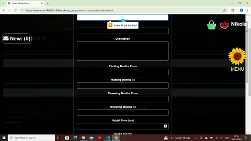

## 2. **Admin Cannot Send New Newspaper Without Text**
   - **Scenario**: The admin attempts to send a new newspaper but forgets to input the text for the newspaper.
   - **Expected Result**: The system will prevent submission and show an error stating "Text field is required."
   - **Image**: 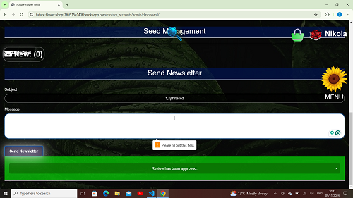

## 3. **Admin Sends New Newspapers**
   - **Scenario**: The admin successfully sends out a new newspaper.
   - **Expected Result**: The newspaper should be sent, and the system confirms the action with a success message.
   - **Image**: 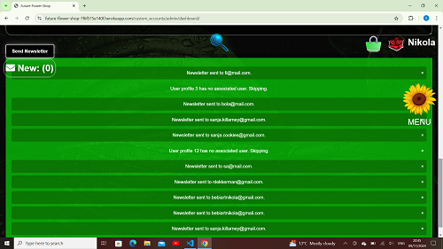

## 4. **Admin Review - Approved**
   - **Scenario**: The admin reviews and approves a submitted article or content.
   - **Expected Result**: The content is marked as "approved" in the admin panel.
   - **Image**: 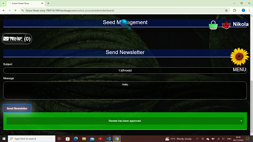

## 5. **Submit Empty Comment**
   - **Scenario**: The usertries to submit a comment but leaves it empty.
   - **Expected Result**: The system prevents submission and prompts the admin to fill in the comment field.
   - **Image**: 

## 6. **Login with Incorrect Password**
   - **Scenario**: A user attempts to log in with an incorrect password.
   - **Expected Result**: The system displays an error indicating the password is wrong.
   - **Image**: 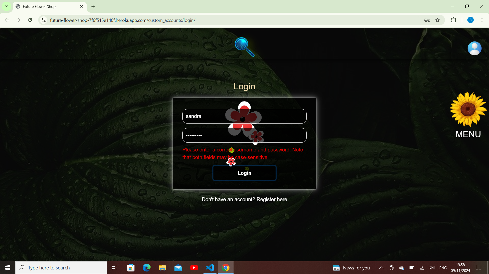

## 7. **Login with Incorrect Username**
   - **Scenario**: A user attempts to log in with an incorrect username.
   - **Expected Result**: The system displays an error message indicating the username is not recognized.
   - **Image**: 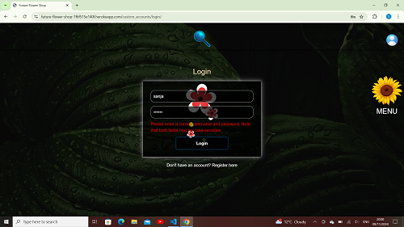

## 8. **Registration Without Name**
   - **Scenario**: A user attempts to register without filling in the "name" field.
   - **Expected Result**: The registration form should show an error asking the user to provide their name.
   - **Image**: 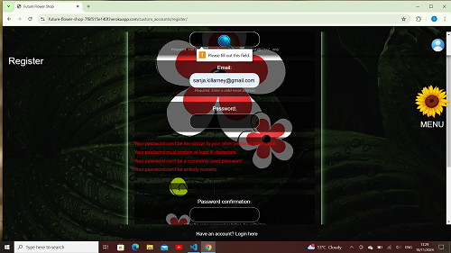

## 9. **Registration with Invalid Email**
   - **Scenario**: A user attempts to register with an invalid email format.
   - **Expected Result**: The system should prompt the user with an error message asking for a valid email address.
   - **Image**: 

## 10. **Registration with Invalid Password**
   - **Scenario**: A user attempts to register with a password that doesn't meet the required criteria (e.g., too short).
   - **Expected Result**: The system should prompt the user with an error indicating the password does not meet the security requirements.
   - **Image**: 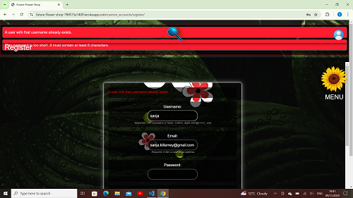

## 11. **Registration with Invalid Username**
   - **Scenario**: A user attempts to register with an invalid username (e.g., already taken).
   - **Expected Result**: The system should inform the user that the username is already taken and prompt them to choose a different one.
   - **Image**: 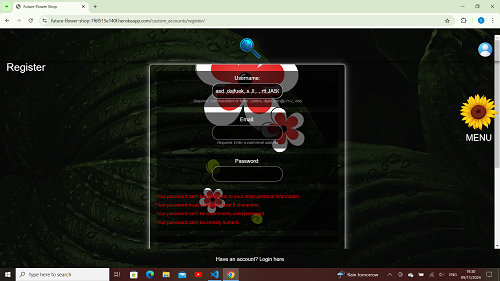

## 12. **Send Newspaper Without Text**
   - **Scenario**: The admin attempts to send out a newspaper without adding any text.
   - **Expected Result**: The system will prevent the action and prompt for the text to be added.
   - **Image**: 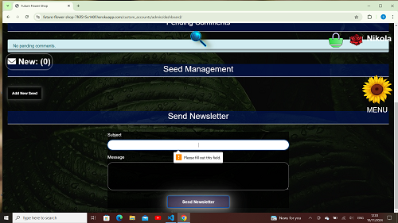

## 13. **Shopping Cart with Valid Card Details**
   - **Scenario**: A user attempts to checkout with valid card details.
   - **Expected Result**: The system processes the payment and completes the checkout successfully.
   - **Image**: 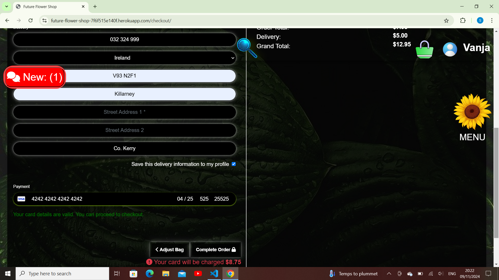

## 14. **Shopping Cart with Wrong Card Details**
   - **Scenario**: A user attempts to checkout with incorrect card details (e.g., expired card, incorrect number).
   - **Expected Result**: The system will display an error about invalid card details.
   - **Image**: 

## 15. **Shopping Cart with Wrong Email**
   - **Scenario**: A user attempts to checkout with an incorrect email address.
   - **Expected Result**: The system should display an error stating that the email is invalid.
   - **Image**: 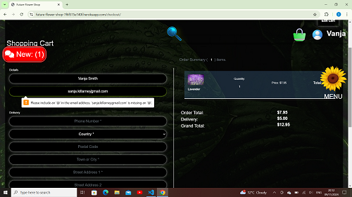

---
